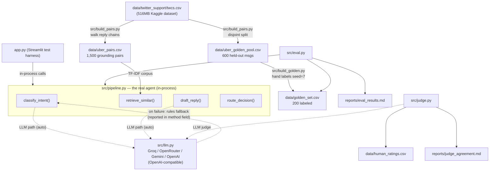
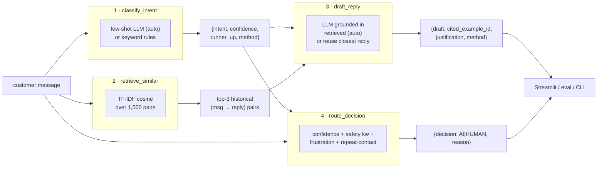

# Architecture — Uber_Support AI Agent

> Scope note: this is a **single-process Python system**, not a multi-service web app. There is
> no separate backend server, database, auth layer, camera, image pipeline, or cloud deployment.
> The "frontend" is a Streamlit test harness (`app.py`) that imports and calls the pipeline
> functions **in-process** — there is no HTTP/API boundary between them. The diagrams below
> reflect the code as it actually is.

## System diagram (actual)



## Upgraded pipeline (Phase 4–19) — components + fallbacks

```mermaid
flowchart TD
    U["customer message"] --> PRE["preprocess.clean_for_embedding<br/>(context-preserving: keeps app≠car, driver, etc.)"]
    PRE --> C

    subgraph C["1 · INTENT + CONTEXT ANALYST — classify_intent"]
        Cllm["few-shot LLM (Groq)"] -. fail/no key .-> Crules["rule classifier<br/>(context-safety aware)"]
        Cout["intent, confidence, runner_up,<br/>needs_context, method"]
    end
    C --> R

    subgraph R["2 · SEMANTIC RETRIEVAL — retrieve_similar (method=auto)"]
        Rst["sentence-transformers<br/>all-MiniLM-L6-v2 (best: 0.715)"] -. unavailable .-> Rhy["hybrid: TF-IDF+LSA<br/>+ lexical rerank"] -. .-> Rtf["TF-IDF"]
    end
    R --> D

    subgraph D["3 · GROUNDED RESPONSE — draft_reply"]
        Dllm["LLM draft (anti-DM, evidence-grounded)"] --> V["verify_draft:<br/>no invented URL / no unsupported promise"]
        V -- hard fail --> Dre["regenerate strict"] --> V
        V -- still fail --> Dsafe["safe reused-reply template"]
        Dllm -. no key/err .-> Dsafe
    end
    D --> S

    subgraph S["4 · SAFETY + ROUTING — detect_safety + route_decision"]
        Sdet["detect_safety: LLM verifier<br/>|| NLP rules (whole-word+window+negation)"]
        Srt["route: safety + confidence + frustration + repeat"]
    end
    S --> OUT["AI / HUMAN + plain-English reason"]

    FT["advanced/: fine-tuned DistilBERT<br/>(real SFT, offline alt classifier — evaluated, trails LLM)"] -. optional .-> C
```

Every stage reports the real backend in its `method` field (llm:groq / rules / st / hybrid /
rules_fallback). Neural retrieval and the fine-tuned model degrade gracefully when HF weights are
unavailable — the base pipeline never hard-depends on a download.

## Agent chain / workflow (per message)



## The four stages ("agents")

| # | Stage / function | Trigger | Input | Processing | Model/tool | Output | Consumed by | On failure | If no key |
|---|---|---|---|---|---|---|---|---|---|
| 1 | `classify_intent` | any message | raw message | few-shot prompt → JSON, or keyword scores | `src/llm.py` (LLM) **or** rules | `{intent, confidence, runner_up, method}` | stages 3 & 4 | LLM error → rules, reported in `method` | uses rules (`method="rules"`) |
| 2 | `retrieve_similar` | any message | raw message | TF-IDF vectorize + cosine top-k | scikit-learn (no network) | `[{pair_id, customer_msg, brand_reply, score}]` | stage 3 | raises clear `FileNotFoundError` if corpus missing | always works (offline) |
| 3 | `draft_reply` | after stages 1–2 | message + retrieved | LLM grounded in retrieved cases → JSON, or reuse closest reply | `src/llm.py` (LLM) **or** rules | `{draft, cited_example_id, justification, method}` | display layer | LLM error → reuse closest reply, reported in `method` | reuses closest historical reply |
| 4 | `route_decision` | after stage 1 | classification + message + thread history | combine 4 signals into AI/HUMAN + reason | pure Python | `{decision, reason}` | display layer | n/a (no external dep) | n/a |

## Feedback / human-verified resolution memory layer

Additive to the four stages above; the base pipeline is unchanged. This is **retrieval augmentation
from verified human resolutions**, not model training.

| Module | Responsibility |
|---|---|
| `src/config.py` | All thresholds/weights (similarity, trust boost, conflict, dissatisfaction, repeat) — one place, justified + tested. |
| `src/satisfaction.py` | Explicit + implicit dissatisfaction detection (LLM verifier or NLP rules; honest `method`). Bare technical complaint ≠ dissatisfaction. |
| `src/escalation.py` | `decide()` — transparent AI-vs-HUMAN engine returning `{route, reason, confidence, signals}` (superset of `route_decision`). |
| `src/memory.py` | Verified-resolution JSONL store: `build_record` / `add_resolution` (trust gate + content-hash dedup) / `find_conflicts` / `load_resolutions`. |
| `src/resolution_retrieval.py` | Retrieves verified resolutions in the fitted TF-IDF space; gated by threshold + intent + `verified`. |
| `src/ui_state.py` | Streamlit-free state transitions: `apply_feedback` (feedback→escalation policy) and `build_escalation_record`. |
| `src/memory_eval.py` | Deterministic Recall@K / ranking / gating evaluation → `reports/memory_eval.md`. |

**Two-layer retrieval merge** — `pipeline.retrieve_similar(message, k, method, intent, use_memory,
memory_path)` now queries (1) the verified-resolution layer and (2) the historical layer, applies
`VERIFIED_TRUST_BOOST` to eligible verified items, ranks, and returns the top-k with added `source`
(`human_resolution`|`historical`) and `verified` fields. When the memory file is empty the output is
byte-for-byte the historical-only result (back-compat; existing `test_retrieve_contract` still holds).

## Data-flow guarantees (verified)
- **No leakage:** `uber_pairs.csv` (retrieval) and `uber_golden_pool.csv` (golden source) are
  disjoint by construction (`build_pairs.py` split) — the agent is never evaluated on messages
  the retriever has memorized.
- **Deterministic rebuild:** seeds fixed (`build_pairs` seed=42, golden sample seed=7). A clean
  rebuild from the raw csv reproduces the identical golden set and metrics.
- **Honest degradation:** every LLM stage reports in its `method` field whether the LLM or the
  rule fallback produced the result — `app.py` never fabricates a result if the API is down.
