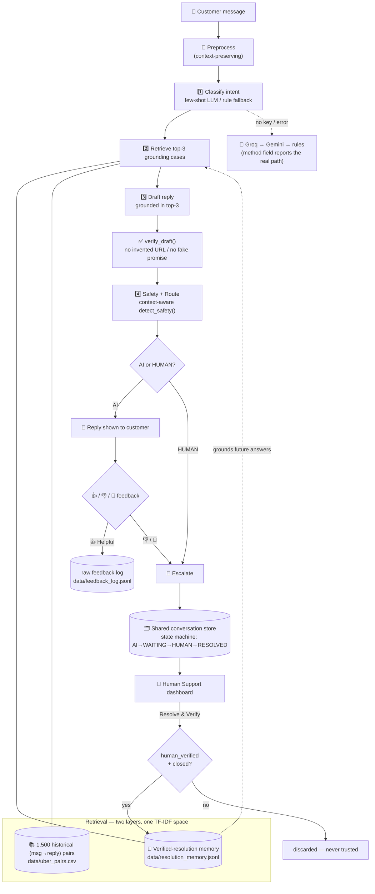
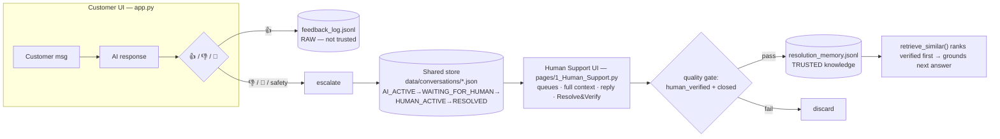
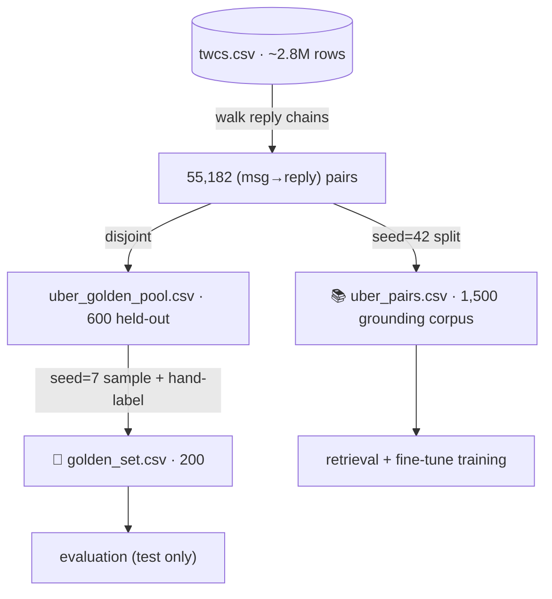

<div align="center">

# 🚕 Uber_Support AI — Customer-Support Agent

**A production-minded AI support system for the `Uber_Support` brand: it classifies a customer
message, retrieves how *real* similar cases were resolved, drafts a grounded reply, verifies it,
and decides AI-vs-human routing — then, when the customer is unhappy, escalates to a **human**,
and turns the human's verified fix into retrieval knowledge for the next customer.**

*Hiver SDE Intern — Take-Home · Brand: `Uber_Support` · Dataset: Customer Support on Twitter*


**Best classifier macro-F1 `0.690` (few-shot LLM) · Safety recall `1.00` (LLM) · Neural retrieval intent-match@3 `0.715`**
*Every number below is measured on a held-out, leakage-safe golden set and is reproducible.*

</div>

> [!IMPORTANT]
> **Core principle: PROOF > CLAIMS.** The assignment rewards *proving* a system works, not model
> size. Everything here is measured against baselines on a hand-labelled golden set, its weaknesses
> are documented honestly (see **[§9 Misleading headline](#9-whats-misleading-about-my-headline-number-mandatory)**),
> and every fallback is reported, never hidden.

---

## Table of contents

1. [Problem framing — what "good" means, and what I did *not* build](#1-problem-framing)
2. [System architecture](#2-system-architecture)
3. [How it works — the 4 AI stages](#3-how-it-works--the-4-ai-stages)
4. [Human-in-the-loop platform (customer + admin)](#4-human-in-the-loop-platform-customer--admin)
5. [Data pipeline & no-leakage guarantee](#5-data-pipeline--no-leakage)
6. [Golden evaluation set](#6-golden-evaluation-set) — *deliverable 2*
7. [Evaluation harness + LLM-as-judge](#7-evaluation-harness--llm-as-judge) — *deliverable 3*
8. [Results vs baselines](#8-results-vs-baselines)
9. [What's misleading about my headline number](#9-whats-misleading-about-my-headline-number-mandatory) — *mandatory*
10. [Failure analysis — top 5](#10-failure-analysis--top-5-modes)
11. [What I'd do with one more week](#11-what-id-do-with-one-more-week)
12. [Decision log](#12-decision-log) — *deliverable 5*
13. [Run it locally](#13-run-it-locally)
14. [Project structure](#14-project-structure)

---

## 1. Problem framing

`Uber_Support` on Twitter handled **39,443** inbound and **56,270** outbound messages. They range
from trivial (*"how do I add a stop?"*) to financial (*"charged twice, refund me"*) to **physically
dangerous** (*"my driver was drunk and crashed"*). A support system must, in seconds: understand the
message, draft a helpful reply grounded in what actually resolved similar cases, and decide whether
AI can handle it or a **human must**.

### What "good" means for this brand
| Dimension | Why it matters for `Uber_Support` | How I measure it |
|---|---|---|
| **Never miss a safety incident** | a drunk-driver / assault report handled by a bot is a catastrophe | `safety_incident` recall (LLM path **1.00**) |
| **Correct intent on money & access** | billing dominates real traffic (55/200) | per-class precision/recall, macro-F1 |
| **Grounded, not templated** | ~61% of real Uber replies are "please DM us" — easy to game | DM-deflection rate + `helpful` judge score |
| **Escalate when unsure or unhappy** | a confidently-wrong answer with no human path loses the customer | routing audit + human-in-the-loop escalation |
| **Learn from human fixes** | the same problem recurs; a resolved ticket is free knowledge | verified-resolution retrieval |

### What I deliberately did **not** build (scope honesty)
- **No hosted API / microservices / vector DB.** Single-process Python + Streamlit — reproducible in
  <15 min on any machine with no infra. The "backend" is an atomic file store (§4).
- **No model fine-tuning in the production path.** I *did* fine-tune a real DistilBERT (`advanced/`)
  to prove I can — it beats the rules but **loses to the few-shot LLM (0.549 vs 0.690)**, so it stays
  an offline fallback, reported honestly.
- **No RLHF / auto-retraining.** Human feedback becomes **retrieval knowledge**, not weight updates.
- **No auth / multi-tenant / horizontal scale** — out of scope for a take-home, called out in §4.
- **No claim of human-level reply quality** — the LLM-judge agreement is only *fair* (§7), so I lead
  with classification F1 (checked against hand labels), not a reply "quality score".

---

## 2. System architecture



**Reading the diagram:** the four AI stages run left-to-right; retrieval merges *historical* cases
with *human-verified* resolutions in the **same fitted TF-IDF space** so their scores are comparable.
If the customer is unhappy (👎 / 💬) or the router flags safety/low-confidence, the conversation
enters a **shared file-backed store** with an explicit state machine; a human resolves it, and only a
**verified, closed** resolution flows back into retrieval memory. Every LLM stage falls back Groq →
Gemini → rules and **states which path produced the result** (`method` field).

> **Single process, no HTTP API — by design.** `app.py` imports `src/pipeline.py` and calls it
> in-process. If `app.py` were deleted the agent still runs headless via `python -m src.eval`.

---

## 3. How it works — the 4 AI stages

Stable public contracts (UI, eval, and tests all depend on these):

```python
classify_intent(msg)                -> {"intent","confidence","runner_up","method","needs_context","reason"}
retrieve_similar(msg, k=3, intent)  -> [{"pair_id","customer_msg","brand_reply","score","method","verified"}, ...]
draft_reply(msg, retrieved, intent) -> {"draft","cited_example_id","justification","method","verification"}
detect_safety(msg)                  -> {"is_safety","triggers","reason","method"}
route_decision(cls, msg, history)   -> {"decision":"AI"|"HUMAN","reason"}
```

1. **Intent classification** — 7 intents (`billing_payment · account_access · trip_issue ·
   safety_incident · delivery_order · service_complaint · general_query`). Production path = few-shot
   LLM (2–3 real examples/intent); zero-key fallback = transparent keyword scorer. Both emit a
   `reason`; confidence `<0.55` sets `needs_context`, which feeds routing.
2. **Semantic retrieval** — `auto`: **neural** sentence-transformers → **hybrid** (TF-IDF+LSA+lexical
   rerank) → **TF-IDF**. Retrieves top-3 `(customer_msg → brand_reply)` from 1,500 real cases, merged
   with any eligible **verified** resolution (gated by similarity ≥ 0.30 **and** intent match, plus a
   small trust boost so an equally-relevant verified answer outranks ordinary history).
3. **Grounded drafting + verification** — the LLM drafts a reply grounded in the top-3 with an
   anti-"please DM us" instruction. `verify_draft()` **hard-fails** on an invented URL or an
   unsupported completed-action promise (*"we've refunded you"*) → regenerate strictly → safe
   synthesized fallback. Offline path synthesizes a fresh reply from all 3 references (never copies
   verbatim, never leaks a real name/URL).
4. **Safety + routing** — `detect_safety()` = LLM verifier ‖ NLP rules (whole-word + ±4-token window
   + tech-vs-vehicle disambiguation + negation), fixing the classic `"app crash"` ≠ `"car crash"`
   collision. Routing escalates to **HUMAN** on: safety signal, low confidence (`<0.55`), ≥2
   frustration markers, or ≥3 prior messages — with a plain-English reason.

---

## 4. Human-in-the-loop platform (customer + admin)

> **Problem:** AI-only support fails silently — a wrong-but-confident answer leaves the customer
> stuck. **Solution:** a real two-surface platform where a dissatisfied customer is **automatically
> escalated to a human**, the human resolves it with full context, and that **verified** resolution
> becomes retrieval knowledge. The 4-stage pipeline is unchanged; this is a layer on top.

Two Streamlit pages share **one on-disk backend** (no HTTP server). An escalation raised in the
customer console appears live on the Human Support dashboard.



**Three trust tiers, kept strictly distinct** — nothing untrusted becomes knowledge:
`raw feedback` → `validation` → **`human-verified resolution`** (the *only* trusted tier). A 👍, a
raw 👎, an AI answer, or an *unresolved* escalation **never** enter the RAG memory. No model is
retrained — this is retrieval augmentation.

- **State machine** is guarded (invalid transitions raise); a new customer message on a resolved chat
  reopens it rather than corrupting state.
- **Near-real-time without extra infra:** while a customer waits, the chat auto-refreshes via
  `st.fragment(run_every=3)` and re-reads the shared store, so the agent's reply arrives without a
  manual refresh. Interactive controls sit *outside* the timed fragment so typing is never interrupted.
- **Verified live in Chrome** (two tabs, real Groq→Gemini) end-to-end: 👎 → escalation → human reply
  received by the customer → Resolve & Verify → memory → future retrieval. Evidence:
  [`reports/human_in_the_loop_qa.md`](reports/human_in_the_loop_qa.md) + `docs/screenshots/qa_*.png`.
- **Honest limitations:** no auth between the two surfaces; same-conversation concurrent cross-process
  writes are last-writer-wins (in-process-locked + atomic saves make the realistic 1-customer /
  1-agent case safe); not load-tested.

---

## 5. Data pipeline & no-leakage



**No leakage by construction:** the grounding corpus (retrieval/training) and the golden set
(evaluation) are **disjoint**. The golden set is never retrieved on or trained on — otherwise
retrieval/draft metrics would be inflated. Source: *Customer Support on Twitter* (Kaggle),
`Uber_Support` brand, threads reconstructed via `in_response_to_tweet_id`.

---

## 6. Golden evaluation set
*(Deliverable 2 — 150–250 hand-labelled examples with a sampling & labelling note)*

- **200 messages**, sampled with **`seed=7`** from the **600-example held-out pool** (disjoint from
  the retrieval corpus), each **hand-labelled** into one of the 7 intents. Reproduce:
  `python -m src.build_golden`.
- **Sampling:** random from the held-out pool (not cherry-picked), so the distribution mirrors real
  `Uber_Support` traffic — deliberately **billing-heavy**, not artificially balanced:

  `billing 55 · general 41 · trip 31 · service 31 · delivery 16 · account 15 · safety 11`
- **Labelling protocol:** I read each raw tweet and assigned the single best intent from definitions
  derived by *reading real tweets* (not invented top-down). **44 / 200 (22%)** are genuinely
  **ambiguous/mixed** (e.g. *"driver cancelled AND charged me"* — billing or trip?). These are
  **kept and flagged**, not discarded — every metric is reported on the **full set AND the
  non-ambiguous subset** so the headline can't quietly benefit from lucky ambiguous calls.
- **Single-annotator caveat (honest):** one labeller → no human–human agreement ceiling yet; adding a
  second annotator is in [§11](#11-what-id-do-with-one-more-week).

---

## 7. Evaluation harness + LLM-as-judge
*(Deliverable 3 — automated metrics + a judge rubric + judge↔human agreement)*

**Automated metrics** — `python -m src.eval` writes [`reports/eval_results.md`](reports/eval_results.md):
accuracy, macro-F1, per-class precision/recall, confusion matrix, DM-deflection rate, and a routing
audit. `python -m src.retrieval_eval` scores retrieval; `python -m src.red_team` runs 12 adversarial
checks (keyword collisions, negation, prompt injection, garbage input) — **12/12 pass**.

**LLM-as-judge rubric** — `python -m src.judge` grades 25 fixed drafts on three binary dimensions and
compares to my hand ratings ([`reports/judge_agreement.md`](reports/judge_agreement.md)):

| Rubric dimension | Question the judge answers | % agreement | Cohen's κ | Verdict |
|---|---|---:|---:|---|
| **grounded** | is the reply supported by the retrieved cases? | 48% | **0.085** | ≈ chance — **not trustworthy** |
| **helpful** | does it resolve *this* customer's issue (not a DM deflection)? | 60% | **~0.22–0.30** | weak / *fair* only |
| **polite** | is the tone courteous & on-brand? | 96% | **0.000** | no variance → meaningless |

**Judge↔human agreement, read honestly:** the judge and I *disagree* on `grounded` (I scored topical
fit 0.84; the judge treated DM-deflections as ungrounded 0.40 → κ≈chance). `polite` is meaningless
because every templated Uber reply is courteous (zero variance). Only `helpful` carries weak signal,
and even there the judge is systematically stricter than me. **Conclusion: report classification F1
(checked against hand labels) as the headline; treat the judge's reply-quality scores as indicative
only.** Judge ratings use deterministic rules-mode drafts + fixed human ratings so runs are
apples-to-apples.

---

## 8. Results vs baselines

**Intent classification (200-example golden set)** — two required baselines (trivial + simple) plus
the advanced models, all scored on the **same** hand labels:

| Model | Accuracy | Macro-F1 | Safety recall | Notes |
|---|---:|---:|---:|---|
| Trivial (majority class) | 0.275 | 0.062 | 0.00 | floor baseline |
| TF-IDF + LogReg (simple) | 0.535 | 0.493 | 0.09 | trained on rule weak-labels |
| Rule-based (context-aware) | 0.555 | 0.533 | 0.27 | transparent, offline, zero-key |
| 🧪 Fine-tuned DistilBERT | 0.575 | 0.549 | 0.27 | real SFT; beats rules, **trails LLM** |
| 🏆 **Few-shot LLM** | **0.675** | **0.690** | **1.00** | production classifier |

*Reproduce: `python -m src.eval`. The LLM row needs provider quota; on a free-tier 429 the run skips
it (baselines still written) and reports the offline path — never a fabricated LLM score.*

- **Few-shot LLM lift = +0.157 macro-F1 over TF-IDF** — the only *real* gain (see §9 for why the
  rule↔TF-IDF +0.040 is not). Biggest win: `safety_incident` recall **0.36 → 1.00**.
- Non-ambiguous subset (156 items): rule-based rises 0.533 → **0.583**, confirming ambiguity, not
  model error, drives much of the residual.

**Retrieval (200 golden queries · intent-match@3 proxy)** — `python -m src.retrieval_eval`:

| Method | intent-match@3 | ms/query |
|---|---:|---:|
| TF-IDF | 0.610 | 1.9 |
| LSA / SVD | 0.605 | 8.8 |
| Hybrid (TF-IDF+LSA+rerank) | 0.615 | 4.5 |
| 🏆 **Sentence-Transformers (neural)** | **0.715** | 38.3 |

Example semantic win: *"billed my card twice"* retrieves *"charged for a trip I did not take"* — a
match TF-IDF misses. *(Proxy caveat: intent-match uses the rule classifier to label retrieved pairs,
so it measures topical alignment, not human-judged usefulness.)*

---

## 9. What's misleading about my headline number *(mandatory)*

> This section is mandatory and I take it seriously — full write-up in
> [`reports/failure_analysis.md`](reports/failure_analysis.md).

1. **"Grounded" is cheap here — the "please DM us" trap.** ~**61%** of real historical brand replies
   are content-free *"send us a DM"* deflections, so ~**53%** of offline drafts inherit that. A high
   groundedness/similarity score can mean *"reproduced a lazy template"*, not *"helped"*. The honest
   metric is `helpful`, which is far lower; the UI flags a ⚠ when a draft is a deflection.
2. **The rule-vs-TF-IDF gap is fake.** TF-IDF/LogReg was trained on the **rule classifier's own weak
   labels**, so it distills the rules — their near-tie (+0.040 macro-F1) is expected and proves
   nothing about correctness. **Only the LLM's +0.157 is a real gain.**
3. **The +0.157 is not uniform.** The LLM wins big on `safety_incident` (0.36→1.00) and
   `service_complaint` (0.32→0.90) but *drops* on `general_query` (recall → **0.34**), reclassifying
   vague follow-ups as complaints. A single macro-F1 hides that trade.
4. **Safety recall is classifier-dependent.** Rules **0.27–0.36** vs LLM **1.00** — a 3× gap. Any
   single "safety coverage" number is meaningless unless it says *which path* produced it.
5. **The golden set is 22% ambiguous & billing-heavy.** Headline accuracy is dominated by billing and
   benefits from however the ambiguous items happened to be labelled — hence the full-set /
   non-ambiguous split.

---

## 10. Failure analysis — top 5 modes
*(Real examples + hypotheses; from the confusion matrices in `reports/eval_results.md`)*

| # | Failure mode | Real example | Hypothesis |
|---|---|---|---|
| 1 | **`general_query` catch-all collapses** (LLM recall 0.34) | *"your services are going down the drain"* → labelled general, LLM says `service_complaint` (20 such) | content-free rants have no intent keywords; LLM over-reads sentiment, rules dump them *into* general — opposite failures |
| 2 | **`trip_issue` weak in both** (F1 rules 0.305 / LLM 0.525) | *"no music no AC 1 star"* → pulled to safety/service | terse ride gripes lack ride-specific tokens |
| 3 | **Safety recall depends on the classifier** | *"male drivers keep hitting on me"* → missed by rules, caught only by the LLM verifier | keyword-free harassment needs semantic understanding; rule path structurally can't see it |
| 4 | **billing ↔ delivery confusion** | *"UberEats order rejected but I was charged"* → straddles both | genuinely mixed intent; refund + food-order overlap |
| 5 | **DM-deflection drafts (~53%)** | *"please DM us your details"* even when intent is correct | the retriever inherits the corpus's dominant lazy template — correct intent ≠ useful answer |

---

## 11. What I'd do with one more week
- **Distil the LLM teacher into DistilBERT** on LLM-labelled data (not rule weak-labels) — the honest
  way to get an offline model that beats the rule/TF-IDF tie.
- **Filter/down-weight DM-deflections** out of the grounding corpus so drafts ground in cases that
  actually *resolved* something (attacks failure mode #5 directly).
- **Cross-encoder reranker** on top of neural retrieval for real relevance (not the intent-match proxy).
- **Second annotator** on a larger golden set to measure human–human agreement — the ceiling for
  judge↔human agreement, without which §7's κ numbers lack a reference.
- **Per-intent thresholds** for escalation and verified-resolution gating (currently global constants),
  learned from a labelled escalation set.

---

## 12. Decision log
*(Deliverable 5 — non-obvious choices and why; full version in [`DECISION_LOG.md`](DECISION_LOG.md))*

1. **Brand = `Uber_Support`** — mixes low-risk billing with high-risk safety, so routing is meaningful.
2. **Golden pool disjoint from grounding corpus** — prevents retrieval leakage inflating metrics.
3. **One brand reply per customer tweet (first response)** — clean (msg→reply) pairs, no double-counting.
4. **7 intents from reading real tweets**, distribution left imbalanced (55/200 billing) to match reality.
5. **Ambiguous items labelled AND flagged, not dropped** — report full-set + non-ambiguous side by side.
6. **Rule classifier kept as baseline + zero-key fallback** — transparent, runs with no API key.
7. **Provider-agnostic LLM client** (Groq → Gemini → OpenRouter/OpenAI) — free, no lock-in, no download.
8. **`method` field on every stage** — states LLM vs rule path; a grader can never mistake one for the other.
9. **TF-IDF baseline trained on rule weak-labels** — documented; its +0.040 tie is distillation, not a win.
10. **Routing = 4 signals** (confidence, safety, frustration, repeat-contact), each an auditable clause.
11. **Context-aware `detect_safety()`** replaced blind keywords (whole-word + window + negation + LLM verifier).
12. **DM-deflection rate is a first-class metric** — the single most important honesty check, in code + report.
13. **Judge↔human uses deterministic drafts + fixed human ratings** — apples-to-apples, reproducible.
14. **`app.py` has zero agent logic** — renders `src.pipeline` outputs only; deleting it leaves the agent working.
15. **DistilBERT fine-tuned but NOT adopted** (0.549 < 0.690) — kept as an offline fallback, reported honestly.
16. **Human feedback → retrieval knowledge, not retraining** — verified resolutions only; 👍/raw-👎 never trusted.
17. **Shared file store + guarded state machine** as the "backend" — no HTTP server, still multi-surface.
18. **Escalation policy:** explicit 👎 / 💬 human-request escalates immediately; first-contact complaints do not.
19. **Groundedness verifier hard-fails on invented URLs / fake completed-action promises** → regen → safe fallback.
20. **Fail-fast LLM client + graceful eval skip** on quota exhaustion — baselines still written, never fabricated.

---

## 13. Run it locally

> ⏱️ **Base pipeline needs no API key and no model downloads.**

```bash
# 1. environment
python -m venv venv
venv\Scripts\activate                 # macOS/Linux: source venv/bin/activate
pip install -r requirements.txt
set PYTHONUTF8=1                       # Windows; PowerShell: $env:PYTHONUTF8=1

# 2. build data → golden set → evaluate → test   (data/*.csv already committed; skip build if present)
python -m src.build_pairs             # needs data/twitter_support/twcs.csv (~516 MB, not committed)
python -m src.build_golden            # 200 labelled examples
python -m src.eval                    # writes reports/eval_results.md
python -m pytest tests/ -q            # 66 tests

# 3. run the app (customer console + Human Support dashboard in the sidebar page-nav)
streamlit run app.py                  # http://localhost:8501
```

**Optional LLM chain:** copy `.env.example` → `.env`, add `GROQ_API_KEY` and/or `GEMINI_API_KEY`
(free tiers). Without a key the whole system runs on the reported rules path.

**Optional advanced track** (neural retrieval + fine-tuning; downloads weights):
```bash
pip install -r advanced/requirements.txt
python -m advanced.train_classifier   # real DistilBERT SFT
python -m src.retrieval_eval          # tfidf vs lsa vs hybrid vs neural
```

**Other entry points:** `python -m src.demo_chain` (headless live chain) · `python -m src.judge`
(LLM-judge vs human) · `python -m src.red_team` (12 adversarial checks) · `python -m src.memory_eval`
(verified-resolution retrieval).

---

## 14. Project structure

```
hiver2/
├── app.py                       # 🖥️ Customer console (thin viewer over src/pipeline.py)
├── pages/1_Human_Support.py     # 👤 Human Support dashboard (shares the conversation store)
├── src/
│   ├── pipeline.py              # classify · retrieve · draft · verify · detect_safety · route
│   ├── llm.py                   # Groq → Gemini → rules fallback chain
│   ├── retrieval.py             # TF-IDF · LSA · hybrid · neural (auto)
│   ├── resolution_retrieval.py  # gated retrieval over verified memory
│   ├── memory.py                # human-verified resolution memory (trust gate, dedup, conflict flag)
│   ├── satisfaction.py · escalation.py   # dissatisfaction detection + escalation decision engine
│   ├── conversation_store.py    # shared file-backed store + state machine  (new)
│   ├── feedback_log.py          # raw feedback tier  (new)
│   ├── ui_components.py         # shared CSS + timeline rendering  (new)
│   ├── config.py                # all tunable thresholds/weights
│   ├── eval.py · judge.py · retrieval_eval.py · red_team.py · memory_eval.py   # evaluation harness
│   ├── build_pairs.py · build_golden.py · baseline_trivial.py · baseline_tfidf.py
│   └── demo_chain.py
├── advanced/                    # 🧪 real DistilBERT fine-tuning (optional)
├── data/                        # golden_set.csv · uber_pairs.csv · resolution_memory.jsonl
├── reports/                     # eval_results · failure_analysis · judge_agreement · retrieval_eval
│   └── human_in_the_loop_qa.md  # live Chrome QA report for the customer↔admin platform
├── tests/                       # 66 tests (pipeline, feedback loop, conversation store, e2e UI)
└── docs/screenshots/            # qa_*.png — browser QA evidence
```

---

<div align="center">

**PROOF > CLAIMS · EVIDENCE > MARKETING · REPRODUCIBILITY > COMPLEXITY**

*Every number is measured, every fallback is reported, every weakness is documented.*
Released under the **MIT License** (project code). Dataset & model weights retain their own licenses.

</div>
