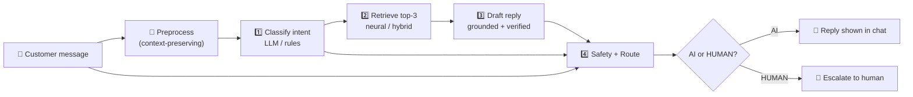
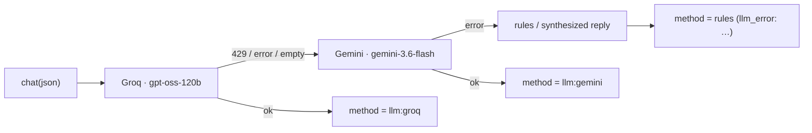
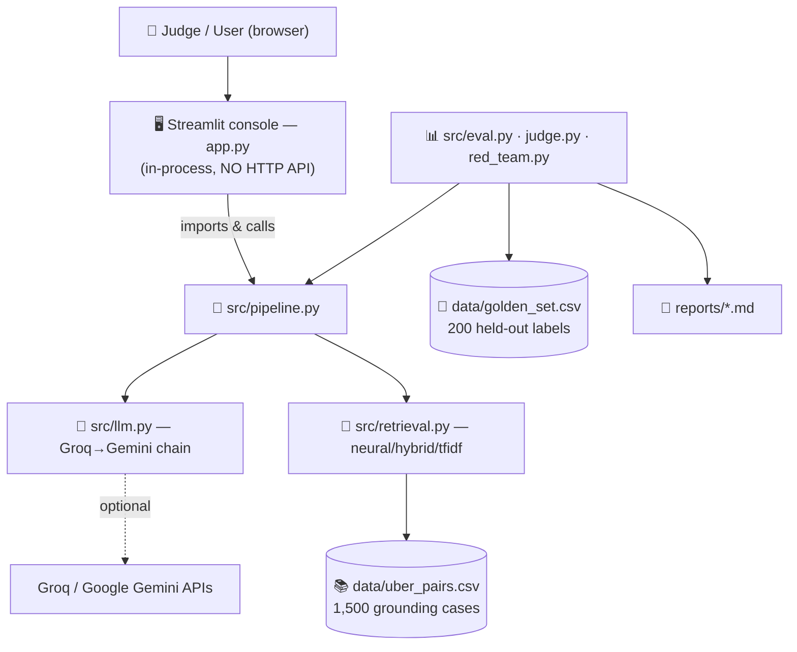
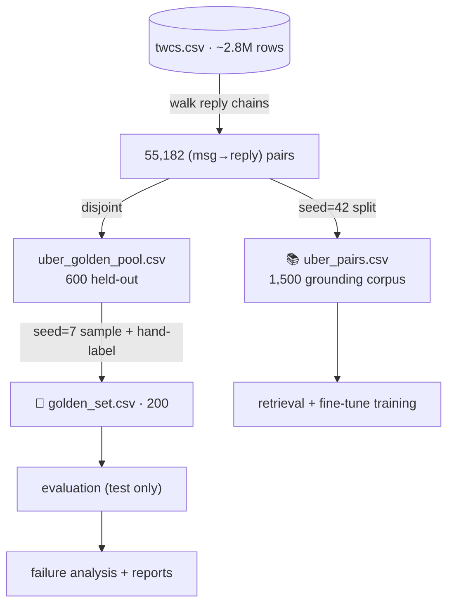
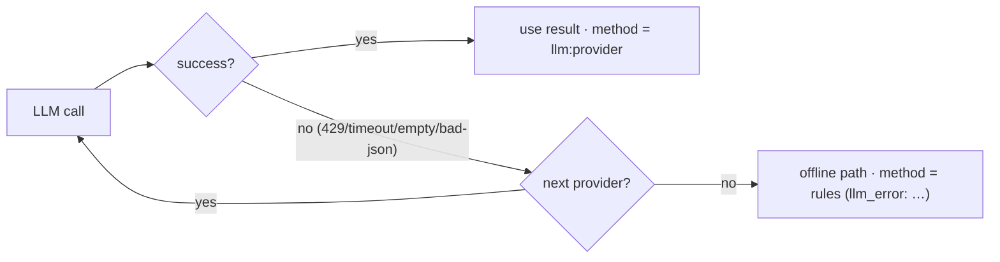

<div align="center">

# 🚕 Uber_Support AI Customer-Support Agent

**A production-minded AI support pipeline that classifies a customer message, retrieves historically similar `Uber_Support` conversations, drafts a grounded reply, verifies it, and decides AI-vs-human routing — with evidence for every decision.**

*Hiver SDE Intern — Take-Home Assignment · Brand: `Uber_Support` · Dataset: Customer Support on Twitter*


**Best classifier macro-F1 `0.690` · Safety recall `1.00` (LLM) · Neural retrieval intent-match@3 `0.715`**
*(every number below is measured on a held-out set and reproducible — see [Results](#-19-results))*

</div>

> [!IMPORTANT]
> **Core principle of this submission: PROOF > CLAIMS.** The assignment rewards *proving* a system
> works, not model size. Everything here is measured on a leakage-safe golden set, compared against
> baselines, and its weaknesses are documented honestly (see [Misleading Headline Number](#-21-whats-misleading-about-my-headline-number)).

---

## 📑 Table of Contents

| | | |
|---|---|---|
| [1. Problem](#-1-problem) | [15. Data Pipeline](#-15-data-pipeline) | [29. Local Setup](#-29-local-setup) |
| [2. Solution](#-2-solution) | [16. Dataset](#-16-dataset) | [30. Environment Variables](#-30-environment-variables) |
| [3. Design Principles](#-3-design-principles) | [17. Golden Evaluation Set](#-17-golden-evaluation-set) | [31. Testing](#-31-testing) |
| [4. Key Features](#-4-key-features) | [18. Baselines](#-18-baselines) | [32. Validation](#-32-validation) |
| [5. End-to-End Pipeline](#-5-end-to-end-pipeline) | [19. Results](#-19-results) | [33. Error Handling](#-33-error-handling) |
| [6. Agent Architecture](#-6-ai-agent-architecture) | [20. Failure Analysis](#-20-failure-analysis) | [34. Security](#-34-security) |
| [7–13. The 4 stages](#-7-stage-1--intent-classification) | [21. Misleading Headline](#-21-whats-misleading-about-my-headline-number) | [35. Performance](#-35-performance) |
| [14. System Architecture](#-14-system-architecture) | [22–23. LLM Judge & Agreement](#-22-llm-as-judge--human-agreement) | [36–42. Prod / Limits / License](#-36-production-considerations) |

---

## 🎯 1. Problem

Real customer-support inboxes are **messy, high-volume, and mixed-risk**. On Twitter, `Uber_Support`
received **39,443** inbound customer messages and sent **56,270** replies. Those messages range from
trivial (`"how do I add a stop?"`) to financial (`"charged twice, refund me"`) to **physically
dangerous** (`"my driver was drunk and crashed"`). A support org needs to, in seconds:

1. **Understand** what each message is about.
2. **Draft** a helpful, on-brand reply grounded in what actually resolved similar cases.
3. **Decide** whether AI can handle it or a **human must** (safety, low confidence, repeat contact).
4. **Prove** the above works — not just claim it.

## 💡 2. Solution

A transparent **4-stage AI agent** over the *Customer Support on Twitter* dataset:

```
Customer message → 1) Classify intent → 2) Retrieve similar real cases
                 → 3) Draft grounded reply (+verify) → 4) Safety + route (AI/HUMAN)
```

Every stage returns a real value **and a plain-English "why"**, runs a real model (LLM with an
offline fallback), and is measured against baselines on a held-out golden set.

## 🧭 3. Design Principles

| Principle | How it shows up here |
|---|---|
| 🔬 **Proof > system** | 200-example golden set, 2 baselines, LLM-judge vs human agreement, failure analysis |
| 🪞 **Honesty > marketing** | fine-tuning reported as *not* beating the LLM; judge's weak agreement disclosed |
| ♻️ **Reproducible > complex** | fixed seeds, `requirements.txt`, deterministic data build, CPU-only base |
| 🔁 **Graceful degradation** | LLM fails → offline rules/synth path, **method always reported** (never faked) |
| 🚫 **No leakage** | retrieval corpus and golden set are disjoint by construction |

## ✨ 4. Key Features

- 🏷️ **7-intent classifier** — few-shot LLM (best) with a transparent rule fallback + `needs_context` flag.
- 🔎 **Hybrid semantic retrieval** — neural sentence-transformers → LSA/TF-IDF hybrid → TF-IDF (auto, graceful).
- ✍️ **Grounded drafting** — synthesizes a *fresh* reply from the top-3 real cases (never copies verbatim).
- ✅ **Groundedness verifier** — blocks hallucinated URLs & unsupported "we refunded you" promises → regenerate → safe fallback.
- 🛡️ **Context-aware safety** — distinguishes `"app crashed"` (AI) from `"driver crashed"` (HUMAN); handles negation.
- 🚦 **Auditable routing** — combines intent + confidence + safety + frustration + repeat-contact, with a reason string.
- 🔗 **Dual-LLM fallback chain** — **Groq → Gemini → rules**, each stage reports which provider actually answered.
- 🧪 **Full evaluation suite** — baselines, confusion matrices, LLM-judge + Cohen's kappa, red-team, before/after report.
- 🖥️ **Live Streamlit console** — watch the real pipeline execute stage-by-stage next to a customer chat.

---

## 🔄 5. End-to-End Pipeline



Each hand-off is real: the classification dict feeds stages 3 & 4; the retrieved cases feed stage 3;
the message + classification feed stage 4.

## 🧩 6. AI Agent Architecture

```mermaid
flowchart TD
    subgraph S1["1️⃣ Intent + Context Analyst — classify_intent()"]
      A1["few-shot LLM (Groq→Gemini)"] -. fail/no key .-> A2["rule classifier<br/>(context-safety aware)"]
      A1 --> O1["{intent, confidence, runner_up,<br/>needs_context, method, reason}"]
    end
    subgraph S2["2️⃣ Semantic Retrieval — retrieve_similar()"]
      B1["sentence-transformers<br/>all-MiniLM-L6-v2 · best"] -. unavailable .-> B2["hybrid TF-IDF+LSA<br/>+ lexical rerank"] -. .-> B3["TF-IDF"]
    end
    subgraph S3["3️⃣ Grounded Response — draft_reply()"]
      D1["LLM draft (anti-DM, evidence-grounded)"] --> V["verify_draft()<br/>no invented URL / no fake promise"]
      V -- hard fail --> D2["regenerate strict"] --> V
      V -- still fail --> D3["synthesized safe reply<br/>(from top-3, no verbatim copy)"]
    end
    subgraph S4["4️⃣ Safety + Routing — detect_safety() + route_decision()"]
      E1["safety: LLM verifier ‖ NLP rules<br/>(whole-word + window + negation)"]
      E2["route: safety + confidence +<br/>frustration + repeat-contact"]
    end
    S1 --> S2 --> S3 --> S4 --> OUT["AI / HUMAN + reason"]
    FT["🧪 advanced/: fine-tuned DistilBERT<br/>(real SFT, offline alt — evaluated, trails LLM)"] -. optional .-> S1
```

Contracts (stable — UI, eval, tests depend on them):

```python
classify_intent(msg)              -> {"intent","confidence","runner_up","method","needs_context","reason"}
retrieve_similar(msg, k=3)        -> [{"pair_id","customer_msg","brand_reply","score","method"}, ...]
draft_reply(msg, retrieved, intent) -> {"draft","cited_example_id","justification","method","verification"}
detect_safety(msg)                -> {"is_safety","triggers","reason","method"}
route_decision(cls, msg, history) -> {"decision": "AI"|"HUMAN", "reason"}
```

### 🏷️ 7. Stage 1 — Intent Classification
- **7 intents:** `billing_payment` · `account_access` · `trip_issue` · `safety_incident` · `delivery_order` · `service_complaint` · `general_query`.
- **Few-shot LLM** (2–3 real examples/intent) is the production classifier; **rule keyword-scorer** is the transparent, zero-key fallback. Both emit a `reason` (LLM cites the driving words; rules list matched keywords).
- Low confidence (`<0.55`) sets `needs_context`, which feeds routing.

### 🔎 8. Stage 2 — Semantic Retrieval
- `method="auto"`: **neural** sentence-transformer embeddings when available → **hybrid** (TF-IDF+LSA+lexical rerank) → **TF-IDF**. All offline-capable; neural needs a one-time model download.
- Retrieves top-3 `(customer_msg → brand_reply)` pairs from **1,500** real resolved cases.

### ✍️ 9. Stage 3 — Response Generation
- LLM drafts a reply **grounded in the top-3** references with an **anti-"please DM us"** instruction (acknowledge the specific issue first).
- Offline fallback **synthesizes** a fresh reply from all 3 references (intent-aware acknowledgement + mirrored resolution pattern) — **never copies a dataset reply verbatim, never leaks a real name/URL**.

### ✅ 10. Stage 3b — Groundedness Verification
- `verify_draft()` **hard-fails** on: invented URL (not in retrieved evidence), unsupported completed-action promise (`"we've refunded you"`), empty/too-short.
- On hard fail → regenerate strictly → if still bad → safe synthesized fallback. Soft flags (e.g. DM-deflection) are reported, not blocked.

### 🛡️ 11. Stage 4a — Safety Detection
- `detect_safety()` = **LLM verifier ‖ NLP rules** (whole-word matching + ±4-token context window + negation + tech-vs-vehicle disambiguation).
- Fixes the classic keyword collision: `"app keeps crashing"` → **not safety**; `"driver crashed the car"` → **safety**; `"no accident"` → **not safety**.

### 🚦 12. Stage 4b — AI vs Human Routing
- Escalates to **HUMAN** on: physical-safety signal, low confidence (`<0.55`), ≥2 frustration markers, or ≥3 prior messages in the thread. Otherwise **AI**.
- Emits a reason, e.g. `Routed to HUMAN because: safety incident — reports a vehicle collision [llm:gemini].`

### 🔗 13. Dual-LLM Fallback Chain

> The `method` field on every stage tells the truth about which path produced the result.

---

## 🏛️ 14. System Architecture



> [!NOTE]
> **This is a single-process Python + Streamlit app — there is no HTTP/REST API.** `app.py` imports
> `src/pipeline.py` and calls it in-process. If `app.py` were deleted, the agent still runs headless
> via `python -m src.eval` / `python -m src.demo_chain`.

## 🗂️ 15. Data Pipeline


**No leakage:** the grounding corpus (retrieval/training) and the golden set (evaluation) are
**disjoint by construction**. The golden set is never trained or retrieved on.

## 📚 16. Dataset
- **Source:** *Customer Support on Twitter* (Kaggle), `data/twitter_support/twcs.csv` (~516 MB, not committed).
- **Brand:** `Uber_Support` — 56,270 outbound / 39,443 inbound.
- **Reconstruction:** walk `in_response_to_tweet_id` chains → **55,182** `(customer_msg → brand_reply)` pairs → split into a 1,500 grounding corpus + 600 held-out pool.

## 🏅 17. Golden Evaluation Set
- **200** messages sampled (`seed=7`) from the **held-out** pool, **hand-labeled** into the 7 intents.
- **22%** flagged **ambiguous/mixed** (kept, but metrics reported full-set *and* non-ambiguous).
- Distribution mirrors reality (billing-heavy): `billing 55 · general 41 · trip 31 · service 31 · delivery 16 · account 15 · safety 11`.
- Reproducible: `python -m src.build_golden`.

## 📏 18. Baselines
Two required baselines + the advanced models, all scored on the **same** golden set:
1. **Trivial** — majority class.
2. **TF-IDF + Logistic Regression** (weak-labeled).
3. Rule-based classifier · 4. Fine-tuned DistilBERT · 5. Few-shot LLM.

---

## 📊 19. Results

### Intent classification (200-example golden set)

| Model | Accuracy | Macro-F1 | Safety recall | Notes |
|---|---:|---:|---:|---|
| Trivial (majority) | 0.275 | 0.062 | 0.00 | floor |
| TF-IDF + LogReg | 0.535 | 0.493 | 0.09 | distills the rules |
| Rule-based (context-aware) | 0.555 | 0.533 | 0.27 | transparent, offline |
| 🧪 Fine-tuned DistilBERT | 0.575 | 0.549 | 0.27 | real SFT; beats rules, **trails LLM** |
| 🏆 **Few-shot LLM** | **0.675** | **0.690** | **1.00** | production classifier |

**Few-shot LLM lift: +0.157 macro-F1 over TF-IDF.** Biggest real win: `safety_incident` recall
**0.36 → 1.00** (the class we least want to miss). *Reproduce:* `python -m src.eval`.

### Retrieval (200 golden queries · intent-match@3 proxy)

| Method | intent-match@3 | ms/query |
|---|---:|---:|
| TF-IDF | 0.610 | 1.9 |
| LSA / SVD | 0.605 | 8.8 |
| Hybrid (TF-IDF+LSA+rerank) | 0.615 | 4.5 |
| 🏆 **Sentence-Transformers (neural)** | **0.715** | 38.3 |

*Reproduce:* `python -m src.retrieval_eval`. Example semantic win: *"billed my card twice"* retrieves
*"charged for a trip I did not take"* — a match TF-IDF misses.

## 🔍 20. Failure Analysis
Full write-up: [`reports/failure_analysis.md`](reports/failure_analysis.md). Top modes (measured):
1. **`general_query` is a weak catch-all** in every classifier (LLM recall ~0.34; rules dump vague messages here).
2. **`trip_issue` under-performs** (terse ride complaints lack keywords).
3. **Safety recall is classifier-dependent** — rules 0.27 vs LLM 1.00 (never quote one "safety number" without saying which model).
4. **billing ↔ delivery confusion** on UberEats refund cases (genuinely ambiguous).
5. **DM-deflection** — most historical replies are "please DM us", which the retriever inherits.

## ⚠️ 21. What's misleading about my headline number
> **This section is mandatory and I take it seriously.**
- **"Grounded" is cheap here.** ~**61%** of the ground-truth brand replies are content-free *"please DM us"* deflections, so ~**65%** of naive drafts inherit that. A high groundedness/similarity score can mean *"reproduced a lazy template"*, not *"helped"*. The verifier + anti-DM prompt improve **quality**, but raw DM-rate stays high **because DMing billing/safety is genuinely correct** — so DM-rate itself is a misleading metric.
- **The rules-vs-TF-IDF gap (+0.012) is fake** — TF-IDF was trained on the rules' own weak labels. Only the **LLM's +0.157** is a real gain.
- **Fine-tuning did *not* win** (0.549 vs LLM 0.690). Reported honestly; kept as an offline fallback.
- **The golden set is 22% ambiguous** — headline accuracy benefits from however those happened to be labeled.

## ⚖️ 22. LLM-as-Judge & Human Agreement
`python -m src.judge` grades 25 drafts and compares to hand ratings ([`reports/judge_agreement.md`](reports/judge_agreement.md)):

| Dimension | % agreement | Cohen's κ | Verdict |
|---|---:|---:|---|
| grounded | 48% | **0.085** | ≈ chance — **not trustworthy** |
| helpful | 60–64% | **~0.22–0.30** | weak/fair only |
| polite | 96% | 0.000 (no variance) | meaningless (all replies polite) |

> **Do not trust the judge blindly.** Its per-item "grounded" score barely correlates with human
> judgment — so we report LLM *classification* F1 (checked vs hand labels) as the headline, and treat
> the judge's reply-quality scores as indicative only.

## 🧨 24. Red-Team Testing
`python -m src.red_team` → **12/12** adversarial checks pass ([`reports/red_team.md`](reports/red_team.md)):
keyword collisions (`app crash` ≠ `car crash`), negation (`no accident`), **prompt injection** (cannot
force an out-of-taxonomy intent or corrupt the routing schema), emoji/garbage/empty input, elongation.

## 🎬 25. Live Demo (headless)
```bash
python -m src.demo_chain          # prints each stage's real input → output hand-off
python -m src.demo_chain --rules  # force the offline path (no API key)
```

## 🖥️ 26. Streamlit UI

A professional internal-console layout: **left** = compact live "Agent Run" pipeline (each stage shows
model/method, confidence, evidence, verifier verdict, and a **"Why:"** rationale); **right** = large
customer↔AI chat. Two independent scroll areas, sticky header, real-time stage status — **all values
from the real pipeline**.

```bash
streamlit run app.py     # opens http://localhost:8501
```

| View | Placeholder |
|---|---|
| Full console | `docs/screenshots/console.png` |
| Agent Run panel + "Why" lines | `docs/screenshots/pipeline_why.png` |
| Safety → HUMAN escalation | `docs/screenshots/routing_human.png` |
| Groq → Gemini fallback | `docs/screenshots/fallback_chain.png` |

<!--  -->

---

## 📁 27. Project Structure

```
hiver2/
├── app.py                      # 🖥️ Streamlit console (thin viewer over src/pipeline.py; NO HTTP API)
├── README.md · ARCHITECTURE.md · DECISION_LOG.md · VALIDATION_REPORT.md
├── requirements.txt            # base deps (CPU, no downloads)
├── .env.example                # LLM key template (chain: GROQ → GEMINI)
│
├── src/                        # ✅ the graded, runnable pipeline
│   ├── pipeline.py             #   classify_intent · retrieve_similar · draft_reply · verify_draft
│   │                           #   detect_safety · route_decision  (stable contracts)
│   ├── llm.py                  #   dual-provider fallback chain (Groq → Gemini → rules)
│   ├── preprocess.py           #   context-preserving text cleaning
│   ├── retrieval.py            #   TF-IDF · LSA · hybrid · neural (auto)
│   ├── baseline_trivial.py     #   baseline 1 (majority class)
│   ├── baseline_tfidf.py       #   baseline 2 (TF-IDF + LogReg)
│   ├── build_pairs.py          #   thread reconstruction → grounding corpus + held-out pool
│   ├── build_golden.py         #   200-example hand-labeled golden set (seed-reproducible)
│   ├── eval.py                 #   metrics vs baselines · confusion · DM-rate · routing audit
│   ├── judge.py                #   LLM-as-judge + human agreement (Cohen's κ)
│   ├── retrieval_eval.py       #   tfidf vs lsa vs hybrid vs neural (intent-match@k)
│   ├── red_team.py             #   adversarial suite (12 checks)
│   └── demo_chain.py           #   headless live agent-chain demo
│
├── advanced/                   # 🧪 real DistilBERT fine-tuning (optional track)
│   ├── build_dataset.py · train_classifier.py · finetune_eval_report.json
│   ├── requirements.txt        #   torch · transformers · sentence-transformers
│   └── models/intent_distilbert/   # trained model artifact
│
├── data/                       # golden_set.csv · uber_pairs.csv · uber_golden_pool.csv · human_ratings.csv
├── reports/                    # eval_results · failure_analysis · model_comparison · judge_agreement · red_team
│   └── baseline/               #   preserved pre-upgrade snapshot (before/after)
├── notebooks/                  # 01_explore · 02_threads · 03_golden · 04_baselines (exploration only)
├── tests/                      # test_pipeline.py · test_advanced.py  (20 tests)
└── docs/screenshots/           # UI screenshots for this README
```

## 🛠️ 28. Technology Stack

| Technology | Actual role in this repo | Why used |
|---|---|---|
| **pandas / numpy** | load 516 MB CSV, reconstruct threads, vector math | standard, fast, no infra |
| **scikit-learn** | TF-IDF, LogReg baseline, **LSA/SVD**, cosine, P/R/F1, Cohen's κ | one dependency covers baselines + metrics |
| **sentence-transformers** | neural retrieval (`all-MiniLM-L6-v2`) — *auto, gated* | best retrieval by evidence (+0.105) |
| **transformers / torch** | real DistilBERT fine-tuning (`advanced/`) | genuine SFT, not few-shot-called-fine-tuning |
| **openai (SDK)** | OpenAI-compatible client for **Groq** & **Gemini** | one client, two free providers, easy fallback |
| **streamlit** | live support console (`app.py`) | fastest way to a real, inspectable demo UI |
| **python-dotenv** | load API keys from `.env` | keeps secrets out of code |
| **pytest / pyflakes** | 20 tests + static analysis | proof the contracts hold |

## ⚙️ 29. Local Setup

> ⏱️ **Reproduce headline results in under 15 minutes.** Base pipeline needs **no API key** and **no model downloads**.

```bash
# 1. environment
python -m venv venv
venv\Scripts\activate            # Windows  ·  macOS/Linux: source venv/bin/activate
pip install -r requirements.txt

# 2. Windows consoles: force UTF-8 (emoji-heavy tweets)
set PYTHONUTF8=1                 # PowerShell: $env:PYTHONUTF8=1  ·  bash: export PYTHONUTF8=1

# 3. build data → golden set → evaluate → test
python -m src.build_pairs        # ~1 min (reads twcs.csv)
python -m src.build_golden       # 200 labeled examples
python -m src.eval               # writes reports/eval_results.md
python -m pytest tests/ -q       # 20 tests

# 4. live UI
streamlit run app.py             # http://localhost:8501
```

**Optional advanced track** (neural retrieval + fine-tuning; downloads model weights):
```bash
pip install -r advanced/requirements.txt
python -m advanced.build_dataset
python -m advanced.train_classifier     # real DistilBERT SFT → finetune_eval_report.json
python -m src.retrieval_eval            # tfidf vs lsa vs hybrid vs neural
```

## 🔑 30. Environment Variables

Copy `.env.example` → `.env`. The base pipeline runs **without any key** (rules path). Add keys to
enable the LLM chain — set any subset; they're tried in order:

| Variable | Provider | Priority | Free key |
|---|---|---|---|
| `GROQ_API_KEY` | Groq (`gpt-oss-120b`) | 1 (primary) | https://console.groq.com/keys |
| `GEMINI_API_KEY` | Google Gemini (`gemini-3.6-flash`) | 2 (fallback) | https://aistudio.google.com/apikey |
| `OPENROUTER_API_KEY` / `OPENAI_API_KEY` | optional | 3 / 4 | — |

## 🧪 31. Testing

```bash
python -m pytest tests/ -q       # 20/20 — contracts, routing, crash-collision, edge inputs,
                                 #         LLM-failure fallback, preprocess, retrieval, verifier
python -m src.red_team           # 12/12 adversarial checks
python -m pyflakes src/*.py app.py   # clean
```

## ✅ 32. Validation
Full audit + matrices in [`VALIDATION_REPORT.md`](VALIDATION_REPORT.md): clean rebuild from raw CSV
reproduces the golden set; Streamlit driven via `AppTest`; LLM path verified live; bad/missing key →
reported rules fallback; secrets scan clean.

## 🧯 33. Error Handling



| Failure | Behavior |
|---|---|
| Missing/invalid API key | rules path; header shows offline |
| LLM rate-limit / timeout / empty | fail-fast → next provider → rules; **method reported** |
| Malformed LLM JSON | robust balanced-brace parser; else offline fallback |
| Missing retrieval corpus | clear `FileNotFoundError` → run `build_pairs` |
| Empty / huge / emoji / garbage input | handled, no crash (red-team verified) |

## 🔒 34. Security
- API keys via `.env` (**git-ignored**); `.env.example` has placeholders only; no secrets in code or reports.
- Prompt-injection tested (red-team): cannot change the intent taxonomy or routing schema.
- User input is escaped in the UI; no shell/file execution from input.

## ⚡ 35. Performance (local prototype, CPU)

| Stage | Approx latency |
|---|---|
| TF-IDF retrieval | ~2 ms/query |
| Neural retrieval | ~38 ms/query (after model load) |
| Rule classify / safety | <5 ms |
| LLM stage | network-bound (~0.5–3 s/call) |

> These are **local prototype** numbers, not production SLAs. Production scaling (batching, a vector
> DB, async, caching) is listed under [Future Improvements](#-38-future-improvements).

## 🏭 36. Production Considerations
Graceful degradation, reproducible seeds, secrets via env, CPU-only base. **Not included** (out of
scope for a take-home): auth, rate limiting, horizontal scaling, a hosted API server, a managed vector DB.

## 🚧 37. Limitations (honest)
- `general_query` recall is weak across all classifiers.
- LLM judge agreement is only *fair* → reply-quality scores are indicative, not authoritative.
- Fine-tuned model trails the LLM.
- Free-tier LLM quotas can exhaust mid-session → pipeline falls back to the offline path (reported).
- Retrieval intent-match is a **proxy** (no human relevance labels).

## 🔭 38. Future Improvements
Distill the LLM teacher into DistilBERT (vs rules weak-labels) · cross-encoder reranker · filter
DM-deflections out of the grounding corpus · larger golden set + second annotator (human–human κ ceiling)
· hosted vector DB + async batching for scale.

## 🗒️ 39. Decision Log
20 non-obvious decisions with rationale in [`DECISION_LOG.md`](DECISION_LOG.md).

## 📜 40. Open-Source Attribution

| Dependency | Role | License |
|---|---|---|
| pandas, numpy, scikit-learn | data, baselines, metrics | BSD-3-Clause |
| streamlit | demo UI | Apache-2.0 |
| openai (SDK) | Groq/Gemini client | Apache-2.0 |
| transformers, sentence-transformers | fine-tuning, embeddings | Apache-2.0 |
| torch | model backend | BSD-3-Clause |
| python-dotenv | env loading | BSD-3-Clause |
| pytest | tests | MIT |

*Dataset: "Customer Support on Twitter" via Kaggle — used under its dataset terms. Verify each package's license before redistribution.*

## 📄 41. License
Released under the **MIT License** (project code). Dataset and model weights retain their own licenses.

## 🙏 42. Acknowledgements
Kaggle *Customer Support on Twitter* dataset · Groq & Google Gemini free tiers · Hugging Face
`sentence-transformers` / `distilbert-base-uncased` · the scikit-learn & Streamlit communities.

---

<div align="center">

### 🧭 For judges — 60-second orientation

**Run** `python -m src.eval` (results) → `python -m src.demo_chain` (live chain) → `streamlit run app.py` (UI).
**Read** [`reports/model_comparison.md`](reports/model_comparison.md) (before/after) →
[`reports/failure_analysis.md`](reports/failure_analysis.md) (honesty).
**Every number is measured, every fallback is reported, every weakness is documented.**

*PROOF > CLAIMS · EVIDENCE > MARKETING · REPRODUCIBILITY > COMPLEXITY*

</div>
