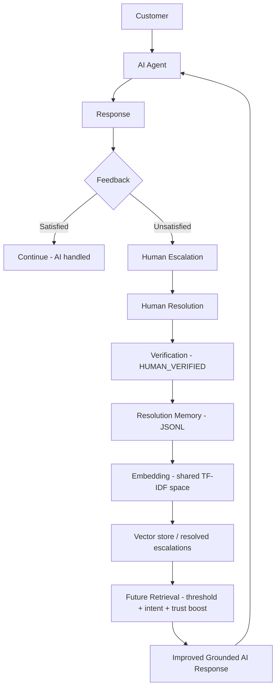

# Verified Resolution Memory RAG Loop — Implementation Plan

> **For agentic workers:** REQUIRED SUB-SKILL: Use superpowers:subagent-driven-development (recommended) or superpowers:executing-plans to implement this plan task-by-task. Steps use checkbox (`- [ ]`) syntax for tracking.

**Goal:** Extend the Uber_Support AI agent with a human-in-the-loop feedback loop where customer dissatisfaction triggers escalation, human agents enter verified resolutions, and those verified resolutions become higher-trust RAG evidence for future queries.

**Architecture:** Four new dependency-light modules (`satisfaction`, `escalation`, `memory`, `resolution_retrieval`) plus additive wiring into `src/pipeline.py` and `app.py`. Verified resolutions persist to `data/resolution_memory.jsonl` and are embedded in the SAME fitted TF-IDF space as the existing 1500-pair corpus, so retrieval scores are comparable. All behavior is back-compatible: when the memory file is empty, the pipeline behaves exactly as today.

**Tech Stack:** Python 3.12, pandas, numpy, scikit-learn (already used), Streamlit, pytest. No new dependencies. No vector DB, no external embedding service.

## Global Constraints

- No new pip dependencies beyond `requirements.txt` (pandas, numpy, scikit-learn, streamlit, python-dotenv, openai, pytest). No Pinecone/Qdrant/Chroma/OpenAI-embeddings/sentence-transformers-required/Postgres/Redis.
- Every module that can run LLM-or-rules MUST report the real path in a `method` field; never fake a status or output.
- Terminology: use "human-verified resolution memory", "retrieval augmentation from resolved escalations", "feedback-driven RAG improvement". NEVER "RLHF", "self-training", or "the model retrains itself" — in code, comments, tests, or docs.
- Only `human_verified is True` + closed resolutions may enter trusted memory. Never learn from raw AI output, raw 👎, or unverified user statements.
- Preserve existing public contracts: `classify_intent`, `retrieve_similar`, `draft_reply`, `verify_draft`, `detect_safety`, `route_decision` keep working. Existing tests in `tests/test_pipeline.py` must still pass.
- Config constants live in `src/config.py`; no magic numbers scattered in logic.
- Run tests with: `python -m pytest tests/ -q` from repo root. Windows shell is PowerShell; the Bash tool is also available.

---

### Task 1: Config constants

**Files:**
- Create: `src/config.py`
- Test: `tests/test_feedback_loop.py`

**Interfaces:**
- Consumes: nothing.
- Produces: module-level constants `RESOLUTION_SIM_THRESHOLD: float`, `VERIFIED_TRUST_BOOST: float`, `CONFLICT_SIM_THRESHOLD: float`, `RESOLUTION_TEXT_DIFF_THRESHOLD: float`, `DISSATISFACTION_THRESHOLD: float`, `REPEAT_SIM_THRESHOLD: float`, `ESCALATE_SECOND_THUMBS_DOWN: bool`, `MEMORY_PATH: str`.

- [ ] **Step 1: Write the failing test**

Create `tests/test_feedback_loop.py`:
```python
"""Tests for the feedback/escalation/verified-memory RAG loop (Steps 2-13, 18 of the spec)."""
import os
import sys
sys.path.insert(0, os.path.dirname(os.path.dirname(os.path.abspath(__file__))))


def test_config_constants_present_and_ranged():
    from src import config
    assert 0.0 < config.RESOLUTION_SIM_THRESHOLD < 1.0
    assert 0.0 < config.VERIFIED_TRUST_BOOST < 1.0
    assert 0.0 < config.CONFLICT_SIM_THRESHOLD < 1.0
    assert 0.0 < config.RESOLUTION_TEXT_DIFF_THRESHOLD < 1.0
    assert 0.0 < config.DISSATISFACTION_THRESHOLD < 1.0
    assert 0.0 < config.REPEAT_SIM_THRESHOLD < 1.0
    assert isinstance(config.ESCALATE_SECOND_THUMBS_DOWN, bool)
    assert config.MEMORY_PATH.endswith(".jsonl")
```

- [ ] **Step 2: Run test to verify it fails**

Run: `python -m pytest tests/test_feedback_loop.py::test_config_constants_present_and_ranged -v`
Expected: FAIL with `ModuleNotFoundError: No module named 'src.config'`.

- [ ] **Step 3: Write minimal implementation**

Create `src/config.py`:
```python
"""Tunable constants for the verified-resolution-memory RAG loop.

Every weight/threshold used by satisfaction detection, escalation, memory, and resolution
retrieval lives here so it is discoverable, justifiable, and testable (spec Steps 5/11/12).
Defaults were chosen conservatively (favour precision — avoid false escalation and avoid trusting
weak matches) and their effect is measured in src/memory_eval.py.
"""
from __future__ import annotations

import os

# --- resolution retrieval (Step 10/11) ---
# A verified resolution is only eligible as evidence if its query-similarity to the incoming
# message is at least this. Below it the match is too weak to trust as a verified answer.
RESOLUTION_SIM_THRESHOLD = 0.45
# Additive score bump applied to a verified resolution at ranking time so it outranks an equally
# relevant ordinary historical reply — but NOT a much-more-relevant one (bump is small on purpose).
VERIFIED_TRUST_BOOST = 0.15

# --- conflict detection (Step 13) ---
# Two verified resolutions conflict when their queries are this similar (same problem) ...
CONFLICT_SIM_THRESHOLD = 0.75
# ... but their resolution TEXT similarity is below this (materially different answers).
RESOLUTION_TEXT_DIFF_THRESHOLD = 0.6

# --- satisfaction / escalation (Steps 3/4) ---
# Implicit-dissatisfaction score at/above which a message is treated as dissatisfied.
DISSATISFACTION_THRESHOLD = 0.6
# Token-Jaccard similarity between the current message and a prior customer message above which we
# count it as a repeated/unresolved question.
REPEAT_SIM_THRESHOLD = 0.5
# Policy: a single 👎 does not force escalation; a SECOND 👎 does (spec-approved).
ESCALATE_SECOND_THUMBS_DOWN = True

# --- persistence (Step 8/9) ---
MEMORY_PATH = os.path.join("data", "resolution_memory.jsonl")
```

- [ ] **Step 4: Run test to verify it passes**

Run: `python -m pytest tests/test_feedback_loop.py::test_config_constants_present_and_ranged -v`
Expected: PASS.

- [ ] **Step 5: Commit**

```bash
git add src/config.py tests/test_feedback_loop.py
git commit -m "feat: config constants for verified-resolution-memory loop"
```

---

### Task 2: Expose fitted TF-IDF space from retrieval.py

**Files:**
- Modify: `src/retrieval.py` (add public helpers near the index functions, ~line 52)
- Test: `tests/test_feedback_loop.py`

**Interfaces:**
- Consumes: existing `retrieval._tfidf_index()` (returns `(vectorizer, matrix)`), `retrieval._corpus()`.
- Produces:
  - `retrieval.tfidf_vectors(texts: list[str]) -> scipy.sparse matrix` — transform arbitrary texts into the ALREADY-FITTED corpus TF-IDF space (no refit).
  - `retrieval.tfidf_cosine(query: str, texts: list[str]) -> numpy.ndarray` — cosine of `query` vs each of `texts` in that fitted space; returns `np.zeros(len(texts))` when `texts` is empty.

- [ ] **Step 1: Write the failing test**

Add to `tests/test_feedback_loop.py`:
```python
def test_tfidf_cosine_same_space_scores_relevant_higher():
    from src import retrieval
    q = "I was billed twice for one ride and need a refund"
    texts = [
        "Uber charged my card two times for the same trip, refund please",   # relevant
        "the driver took a long detour and the route was wrong",              # irrelevant
    ]
    import numpy as np
    scores = retrieval.tfidf_cosine(q, texts)
    assert scores.shape == (2,)
    assert scores[0] > scores[1]
    assert float(retrieval.tfidf_cosine(q, []).shape[0]) == 0.0
```

- [ ] **Step 2: Run test to verify it fails**

Run: `python -m pytest tests/test_feedback_loop.py::test_tfidf_cosine_same_space_scores_relevant_higher -v`
Expected: FAIL with `AttributeError: module 'src.retrieval' has no attribute 'tfidf_cosine'`.

- [ ] **Step 3: Write minimal implementation**

In `src/retrieval.py`, after `_tfidf_index()` (after line 52), add:
```python
def tfidf_vectors(texts):
    """Transform arbitrary texts into the ALREADY-FITTED corpus TF-IDF space (no refit).
    Used by the verified-resolution retrieval layer so its scores share the historical space."""
    vec, _ = _tfidf_index()
    cleaned = [clean_for_embedding(t) for t in texts]
    return vec.transform(cleaned)


def tfidf_cosine(query: str, texts: list) -> np.ndarray:
    """Cosine similarity of `query` vs each text in the fitted TF-IDF space.
    Returns an empty array when `texts` is empty (deterministic, no exceptions)."""
    if not texts:
        return np.zeros(0)
    vec, _ = _tfidf_index()
    q = vec.transform([clean_for_embedding(query)])
    m = tfidf_vectors(texts)
    return cosine_similarity(q, m)[0]
```

- [ ] **Step 4: Run test to verify it passes**

Run: `python -m pytest tests/test_feedback_loop.py::test_tfidf_cosine_same_space_scores_relevant_higher -v`
Expected: PASS.

- [ ] **Step 5: Run the existing retrieval-dependent tests to confirm no regression**

Run: `python -m pytest tests/test_pipeline.py -q`
Expected: all PASS (no behavior changed, only additive helpers).

- [ ] **Step 6: Commit**

```bash
git add src/retrieval.py tests/test_feedback_loop.py
git commit -m "feat: expose fitted TF-IDF space (tfidf_vectors/tfidf_cosine) for resolution retrieval"
```

---

### Task 3: Verified resolution memory store

**Files:**
- Create: `src/memory.py`
- Test: `tests/test_feedback_loop.py`

**Interfaces:**
- Consumes: `src.config` (`MEMORY_PATH`, `CONFLICT_SIM_THRESHOLD`, `RESOLUTION_TEXT_DIFF_THRESHOLD`).
- Produces:
  - `memory.resolution_id(original_query: str, human_resolution: str) -> str` (16-char sha1).
  - `memory.build_record(original_query, human_resolution, intent, escalation_reason, ai_response="", category="", internal_note="") -> dict` — builds a full record with `human_verified=True`, `source="human_resolution"`, ISO `created_at`, `conflict_flag` set by conflict scan.
  - `memory.add_resolution(record: dict, path: str | None = None) -> dict` returns `{"status": "added"|"duplicate"|"rejected_unverified", "resolution_id": str, "conflict_flag": bool}`.
  - `memory.load_resolutions(path: str | None = None) -> list[dict]`.
  - `memory.find_conflicts(record: dict, existing: list[dict] | None = None) -> list[dict]`.

- [ ] **Step 1: Write the failing tests**

Add to `tests/test_feedback_loop.py`:
```python
import json
import pytest


@pytest.fixture()
def tmp_memory(tmp_path):
    return str(tmp_path / "resolution_memory.jsonl")


def _rec(memory, q, r, intent="billing_payment", reason="customer requested human"):
    return memory.build_record(q, r, intent, reason, ai_response="please check payment history")


def test_add_verified_resolution_persists(tmp_memory):
    from src import memory
    rec = _rec(memory, "I was charged twice", "Confirmed duplicate charge; refund issued per policy.")
    out = memory.add_resolution(rec, path=tmp_memory)
    assert out["status"] == "added"
    loaded = memory.load_resolutions(path=tmp_memory)
    assert len(loaded) == 1
    assert loaded[0]["human_verified"] is True
    assert loaded[0]["source"] == "human_resolution"
    assert loaded[0]["resolution_id"] == out["resolution_id"]


def test_duplicate_resolution_prevented(tmp_memory):
    from src import memory
    rec = _rec(memory, "I was charged twice", "Confirmed duplicate charge; refund issued.")
    assert memory.add_resolution(rec, path=tmp_memory)["status"] == "added"
    rec2 = _rec(memory, "I was charged twice", "Confirmed duplicate charge; refund issued.")
    assert memory.add_resolution(rec2, path=tmp_memory)["status"] == "duplicate"
    assert len(memory.load_resolutions(path=tmp_memory)) == 1


def test_unverified_resolution_rejected(tmp_memory):
    from src import memory
    rec = _rec(memory, "app is slow", "we think maybe restart helps")
    rec["human_verified"] = False       # simulate an un-closed / un-verified record
    out = memory.add_resolution(rec, path=tmp_memory)
    assert out["status"] == "rejected_unverified"
    assert memory.load_resolutions(path=tmp_memory) == []


def test_conflict_detected_and_flagged_not_overwritten(tmp_memory):
    from src import memory
    a = _rec(memory, "my promo code will not apply at checkout",
             "Promo codes apply only to your first ride; this one is expired.")
    memory.add_resolution(a, path=tmp_memory)
    b = _rec(memory, "my promo code will not apply at checkout",
             "We manually applied the promo and refunded the difference to your account.")
    out = memory.add_resolution(b, path=tmp_memory)
    assert out["status"] == "added"
    assert out["conflict_flag"] is True
    assert len(memory.load_resolutions(path=tmp_memory)) == 2   # both kept, none overwritten
```

- [ ] **Step 2: Run tests to verify they fail**

Run: `python -m pytest tests/test_feedback_loop.py -k "resolution or conflict" -v`
Expected: FAIL with `ModuleNotFoundError: No module named 'src.memory'`.

- [ ] **Step 3: Write minimal implementation**

Create `src/memory.py`:
```python
"""Human-verified resolution memory (spec Steps 6/8/12/13).

This is NOT model training. A human support agent closes an escalated ticket with a final,
verified resolution; that resolution is appended here as trusted knowledge for future RAG
retrieval. Only human_verified + closed records may enter. Duplicates are prevented by a
content hash; conflicting resolutions for the same problem are flagged and BOTH kept (never
silently overwritten) so the conflict is auditable.

Storage: data/resolution_memory.jsonl — one JSON record per line (deterministic, git-diffable,
no database dependency).
"""
from __future__ import annotations

import hashlib
import json
import os
from datetime import datetime, timezone
from difflib import SequenceMatcher

from . import config


def _norm(text: str) -> str:
    return " ".join(str(text or "").lower().split())


def resolution_id(original_query: str, human_resolution: str) -> str:
    """Deterministic id from the (query, resolution) content — used for dedup."""
    raw = _norm(original_query) + "␟" + _norm(human_resolution)
    return hashlib.sha1(raw.encode("utf-8")).hexdigest()[:16]


def _ratio(a: str, b: str) -> float:
    return SequenceMatcher(None, _norm(a), _norm(b)).ratio()


def load_resolutions(path: str | None = None) -> list:
    path = path or config.MEMORY_PATH
    if not os.path.exists(path):
        return []
    out = []
    with open(path, "r", encoding="utf-8") as f:
        for line in f:
            line = line.strip()
            if line:
                out.append(json.loads(line))
    return out


def find_conflicts(record: dict, existing: list | None = None) -> list:
    """Records with the SAME intent and a very similar query but a materially DIFFERENT
    resolution text (spec Step 13). Query-similarity and resolution-difference both use difflib
    ratio so this module needs no sklearn dependency."""
    existing = existing if existing is not None else load_resolutions()
    conflicts = []
    for e in existing:
        if e.get("intent") != record.get("intent"):
            continue
        q_sim = _ratio(record["original_query"], e["original_query"])
        r_sim = _ratio(record["human_resolution"], e["human_resolution"])
        if q_sim >= config.CONFLICT_SIM_THRESHOLD and r_sim < config.RESOLUTION_TEXT_DIFF_THRESHOLD:
            conflicts.append(e)
    return conflicts


def build_record(original_query: str, human_resolution: str, intent: str, escalation_reason: str,
                 ai_response: str = "", category: str = "", internal_note: str = "") -> dict:
    """Assemble a full verified-resolution record (human_verified=True, closed)."""
    rid = resolution_id(original_query, human_resolution)
    rec = {
        "resolution_id": rid,
        "original_query": original_query,
        "ai_response": ai_response,
        "human_resolution": human_resolution,
        "intent": intent,
        "escalation_reason": escalation_reason,
        "category": category,
        "internal_note": internal_note,
        "human_verified": True,
        "created_at": datetime.now(timezone.utc).isoformat(),
        "source": "human_resolution",
        "conflict_flag": False,
    }
    return rec


def add_resolution(record: dict, path: str | None = None) -> dict:
    """Append a record IF it passes the trust gate + dedup. Returns status.
    Gate: must be human_verified True. Dedup: same resolution_id already present.
    Conflict: flagged on the new record (both kept)."""
    path = path or config.MEMORY_PATH
    if record.get("human_verified") is not True:
        return {"status": "rejected_unverified", "resolution_id": record.get("resolution_id", ""),
                "conflict_flag": False}
    existing = load_resolutions(path)
    rid = record.get("resolution_id") or resolution_id(record["original_query"], record["human_resolution"])
    record["resolution_id"] = rid
    if any(e["resolution_id"] == rid for e in existing):
        return {"status": "duplicate", "resolution_id": rid, "conflict_flag": False}
    conflicts = find_conflicts(record, existing)
    record["conflict_flag"] = bool(conflicts)
    os.makedirs(os.path.dirname(path) or ".", exist_ok=True)
    with open(path, "a", encoding="utf-8") as f:
        f.write(json.dumps(record, ensure_ascii=False) + "\n")
    return {"status": "added", "resolution_id": rid, "conflict_flag": bool(conflicts)}
```

- [ ] **Step 4: Run tests to verify they pass**

Run: `python -m pytest tests/test_feedback_loop.py -k "resolution or conflict" -v`
Expected: all PASS.

- [ ] **Step 5: Commit**

```bash
git add src/memory.py tests/test_feedback_loop.py
git commit -m "feat: human-verified resolution memory store (add/dedup/reject/conflict)"
```

---

### Task 4: Verified-resolution retrieval layer

**Files:**
- Create: `src/resolution_retrieval.py`
- Test: `tests/test_feedback_loop.py`

**Interfaces:**
- Consumes: `src.retrieval.tfidf_cosine`, `src.memory.load_resolutions`, `src.config` (`RESOLUTION_SIM_THRESHOLD`).
- Produces: `resolution_retrieval.retrieve_resolutions(query, intent=None, k=3, path=None) -> list[dict]` where each dict is `{"pair_id", "customer_msg", "brand_reply", "score", "method": "resolution_memory", "source": "human_resolution", "verified": True, "intent", "conflict_flag"}`, sorted by score desc, only items with `score >= RESOLUTION_SIM_THRESHOLD` and (if `intent` given) matching intent.

- [ ] **Step 1: Write the failing tests**

Add to `tests/test_feedback_loop.py`:
```python
def test_verified_resolution_retrieved_when_relevant(tmp_memory):
    from src import memory, resolution_retrieval
    rec = memory.build_record(
        "I was charged twice for the same ride",
        "We confirmed a duplicate charge and the duplicate will be refunded per policy.",
        "billing_payment", "customer rejected AI answer and repeated the issue")
    memory.add_resolution(rec, path=tmp_memory)
    hits = resolution_retrieval.retrieve_resolutions(
        "why was I billed two times for one trip", intent="billing_payment", k=3, path=tmp_memory)
    assert len(hits) == 1
    assert hits[0]["source"] == "human_resolution"
    assert hits[0]["verified"] is True
    assert "duplicate" in hits[0]["brand_reply"].lower()


def test_irrelevant_resolution_not_retrieved(tmp_memory):
    from src import memory, resolution_retrieval
    rec = memory.build_record(
        "I was charged twice for the same ride",
        "We confirmed a duplicate charge and refunded it.",
        "billing_payment", "reason")
    memory.add_resolution(rec, path=tmp_memory)
    hits = resolution_retrieval.retrieve_resolutions(
        "how do I change my profile photo", intent="general_query", k=3, path=tmp_memory)
    assert hits == []


def test_intent_mismatch_excludes_resolution(tmp_memory):
    from src import memory, resolution_retrieval
    rec = memory.build_record(
        "I was charged twice for the same ride",
        "We confirmed a duplicate charge and refunded it.",
        "billing_payment", "reason")
    memory.add_resolution(rec, path=tmp_memory)
    # same words, but caller asserts a different intent -> excluded
    hits = resolution_retrieval.retrieve_resolutions(
        "I was charged twice for the same ride", intent="trip_issue", k=3, path=tmp_memory)
    assert hits == []


def test_empty_memory_returns_empty(tmp_memory):
    from src import resolution_retrieval
    assert resolution_retrieval.retrieve_resolutions("anything", path=tmp_memory) == []
```

- [ ] **Step 2: Run tests to verify they fail**

Run: `python -m pytest tests/test_feedback_loop.py -k "verified_resolution or irrelevant or intent_mismatch or empty_memory" -v`
Expected: FAIL with `ModuleNotFoundError: No module named 'src.resolution_retrieval'`.

- [ ] **Step 3: Write minimal implementation**

Create `src/resolution_retrieval.py`:
```python
"""Retrieval over human-verified resolution memory (spec Step 10).

Each stored resolution's ORIGINAL customer query is embedded in the SAME fitted TF-IDF space as
the 1500-pair historical corpus (via retrieval.tfidf_cosine), so a verified-resolution score is
directly comparable to a historical score and both can be merged/ranked together in the pipeline.

Gating (Step 10/12): a verified resolution is eligible only if it is verified, its query-similarity
to the incoming message clears RESOLUTION_SIM_THRESHOLD, and (when the caller supplies an intent)
the intent matches. High similarity alone is never sufficient — the threshold + intent + verified
flag together decide eligibility.
"""
from __future__ import annotations

from . import config, memory, retrieval


def retrieve_resolutions(query: str, intent: str | None = None, k: int = 3, path: str | None = None) -> list:
    records = memory.load_resolutions(path)
    if not records:
        return []
    queries = [r["original_query"] for r in records]
    scores = retrieval.tfidf_cosine(query, queries)
    out = []
    for rec, score in zip(records, scores):
        if rec.get("human_verified") is not True:
            continue
        if intent is not None and rec.get("intent") != intent:
            continue
        s = float(score)
        if s < config.RESOLUTION_SIM_THRESHOLD:
            continue
        out.append({
            "pair_id": f"res_{rec['resolution_id']}",
            "customer_msg": rec["original_query"],
            "brand_reply": rec["human_resolution"],
            "score": round(s, 4),
            "method": "resolution_memory",
            "source": "human_resolution",
            "verified": True,
            "intent": rec.get("intent", ""),
            "conflict_flag": rec.get("conflict_flag", False),
        })
    out.sort(key=lambda r: r["score"], reverse=True)
    return out[:k]
```

- [ ] **Step 4: Run tests to verify they pass**

Run: `python -m pytest tests/test_feedback_loop.py -k "verified_resolution or irrelevant or intent_mismatch or empty_memory" -v`
Expected: all PASS.

- [ ] **Step 5: Commit**

```bash
git add src/resolution_retrieval.py tests/test_feedback_loop.py
git commit -m "feat: verified-resolution retrieval layer (threshold + intent + verified gating)"
```

---

### Task 5: Dissatisfaction detection

**Files:**
- Create: `src/satisfaction.py`
- Test: `tests/test_feedback_loop.py`

**Interfaces:**
- Consumes: `src.config` (`DISSATISFACTION_THRESHOLD`, `REPEAT_SIM_THRESHOLD`), `src.llm`, `src.preprocess.clean_for_embedding`.
- Produces: `satisfaction.detect_dissatisfaction(message, history=None, explicit_feedback=None, prev_ai_reply="", mode="auto") -> {"dissatisfied": bool, "score": float, "signals": list[str], "method": str}`. `history` is a list of prior customer message strings. `explicit_feedback` ∈ {`"helpful"`, `"not_helpful"`, `"human_request"`, `None`}.

- [ ] **Step 1: Write the failing tests**

Add to `tests/test_feedback_loop.py`:
```python
def test_explicit_helpful_not_dissatisfied():
    from src import satisfaction
    out = satisfaction.detect_dissatisfaction("thanks that worked", explicit_feedback="helpful", mode="rules")
    assert out["dissatisfied"] is False


def test_explicit_human_request_dissatisfied():
    from src import satisfaction
    out = satisfaction.detect_dissatisfaction("connect me to support", explicit_feedback="human_request", mode="rules")
    assert out["dissatisfied"] is True
    assert "explicit_human_request" in out["signals"]


def test_implicit_rejection_phrases_detected():
    from src import satisfaction
    for m in ["That's not what I asked.", "this isn't helping", "you're not understanding me",
              "that answer is wrong", "I want to talk to a human"]:
        out = satisfaction.detect_dissatisfaction(m, mode="rules")
        assert out["dissatisfied"] is True, m


def test_plain_technical_complaint_not_dissatisfied():
    from src import satisfaction
    # a bare technical description is NOT frustration (spec Step 3 — the crucial distinction)
    out = satisfaction.detect_dissatisfaction("the app keeps crashing when I book", mode="rules")
    assert out["dissatisfied"] is False
    assert out["score"] < 0.6


def test_repeated_question_detected():
    from src import satisfaction
    history = ["the app keeps crashing when I open it"]
    out = satisfaction.detect_dissatisfaction(
        "I already told you the app keeps crashing and your answer did not help",
        history=history, mode="rules")
    assert out["dissatisfied"] is True
    assert any("repeat" in s for s in out["signals"])
```

- [ ] **Step 2: Run tests to verify they fail**

Run: `python -m pytest tests/test_feedback_loop.py -k "helpful or human_request or rejection or technical_complaint or repeated_question" -v`
Expected: FAIL with `ModuleNotFoundError: No module named 'src.satisfaction'`.

- [ ] **Step 3: Write minimal implementation**

Create `src/satisfaction.py`:
```python
"""Customer-dissatisfaction detection — explicit + implicit (spec Steps 2/3).

Mirrors the dual-path discipline of pipeline.detect_safety: an LLM verifier when a key is present
(reads the message + previous AI reply + short history), else a dependency-free NLP rule detector.
The method field always states which path ran.

Crucial distinction (Step 3): a bare technical complaint ("the app keeps crashing") is NOT
dissatisfaction. Dissatisfaction requires a rejection/complaint-about-the-help pattern, an explicit
negative/human signal, or a repeated unresolved question.
"""
from __future__ import annotations

import re

from . import config, llm
from .preprocess import clean_for_embedding

# Whole-phrase rejection / dissatisfaction patterns (regex, case-insensitive).
_REJECTION_PATTERNS = [
    r"not what i (asked|meant|wanted)",
    r"(is|are)n'?t helping", r"(this|that) (still )?(does|doesn'?t|did not|didn't) (work|help)",
    r"not (understanding|listening|helping) me", r"you keep saying", r"same (thing|answer)",
    r"already (told|said|explained)", r"(answer|response|reply) is wrong", r"that'?s wrong",
    r"wrong answer", r"didn'?t (help|work|answer)", r"still (not|doesn'?t|isn'?t)",
    r"useless", r"unacceptable",
]
# Explicit request-for-human patterns.
_HUMAN_PATTERNS = [
    r"talk to (a |an )?(human|person|agent|someone|representative)",
    r"(connect|transfer) me", r"real (person|human|agent)", r"speak to (a |an )?(human|person|agent)",
    r"want (a |an )?(human|agent|person)", r"customer service rep",
]

_REJECTION_RE = [re.compile(p, re.I) for p in _REJECTION_PATTERNS]
_HUMAN_RE = [re.compile(p, re.I) for p in _HUMAN_PATTERNS]


def _jaccard(a: str, b: str) -> float:
    sa, sb = set(clean_for_embedding(a).split()), set(clean_for_embedding(b).split())
    return len(sa & sb) / len(sa | sb) if (sa | sb) else 0.0


def _detect_rules(message: str, history, explicit_feedback, prev_ai_reply) -> dict:
    signals, score = [], 0.0
    if explicit_feedback == "helpful":
        return {"dissatisfied": False, "score": 0.0, "signals": ["explicit_helpful"], "method": "rules"}
    if explicit_feedback == "human_request":
        signals.append("explicit_human_request"); score = 1.0
    elif explicit_feedback == "not_helpful":
        signals.append("explicit_thumbs_down"); score = max(score, 0.6)

    if any(r.search(message) for r in _HUMAN_RE):
        signals.append("explicit_human_request"); score = 1.0
    if any(r.search(message) for r in _REJECTION_RE):
        signals.append("rejection_language"); score = max(score, 0.7)

    for prior in (history or []):
        if _jaccard(message, prior) >= config.REPEAT_SIM_THRESHOLD:
            signals.append("repeated_unresolved_question"); score = max(score, 0.65)
            break

    dissatisfied = score >= config.DISSATISFACTION_THRESHOLD
    # de-dup signals, keep order
    seen, uniq = set(), []
    for s in signals:
        if s not in seen:
            seen.add(s); uniq.append(s)
    return {"dissatisfied": dissatisfied, "score": round(score, 3), "signals": uniq, "method": "rules"}


def _detect_llm(message: str, history, explicit_feedback, prev_ai_reply) -> dict:
    # explicit signals are authoritative — short-circuit without spending a call
    if explicit_feedback == "helpful":
        return {"dissatisfied": False, "score": 0.0, "signals": ["explicit_helpful"], "method": "rules"}
    if explicit_feedback == "human_request":
        return {"dissatisfied": True, "score": 1.0, "signals": ["explicit_human_request"], "method": "rules"}
    hist = " | ".join((history or [])[-3:])
    system = (
        "You judge whether a customer is DISSATISFIED with support help. A neutral technical "
        "description of a problem (e.g. 'the app keeps crashing') is NOT dissatisfaction. "
        "Dissatisfaction = rejecting the help, repeating an unresolved issue, frustration with the "
        "agent, or asking for a human. Read the previous AI reply and history for context.\n"
        'Respond ONLY with JSON: {"dissatisfied": 0 or 1, "score": <0-1 float>, '
        '"reason": "<one short clause>"}.'
    )
    user = f'Previous AI reply: "{prev_ai_reply}"\nHistory: "{hist}"\nCurrent message: "{message}"'
    from .pipeline import _loads
    data = _loads(llm.chat([{"role": "system", "content": system}, {"role": "user", "content": user}],
                           temperature=0.0, max_tokens=400, json_mode=True))
    dissatisfied = bool(int(data.get("dissatisfied", 0)))
    score = float(data.get("score", 0.0))
    if explicit_feedback == "not_helpful":
        score = max(score, 0.6); dissatisfied = dissatisfied or score >= config.DISSATISFACTION_THRESHOLD
    sig = [str(data.get("reason", "")).strip()] if data.get("reason") else []
    return {"dissatisfied": dissatisfied, "score": round(max(0.0, min(1.0, score)), 3),
            "signals": sig or (["dissatisfied"] if dissatisfied else []), "method": f"llm:{llm.last_provider()}"}


def detect_dissatisfaction(message: str, history=None, explicit_feedback=None,
                           prev_ai_reply: str = "", mode: str = "auto") -> dict:
    if mode == "rules":
        return _detect_rules(message, history, explicit_feedback, prev_ai_reply)
    if mode == "llm":
        return _detect_llm(message, history, explicit_feedback, prev_ai_reply)
    if llm.llm_available():
        try:
            return _detect_llm(message, history, explicit_feedback, prev_ai_reply)
        except Exception as e:
            out = _detect_rules(message, history, explicit_feedback, prev_ai_reply)
            out["method"] = f"rules (llm_error: {type(e).__name__})"
            return out
    return _detect_rules(message, history, explicit_feedback, prev_ai_reply)
```

- [ ] **Step 4: Run tests to verify they pass**

Run: `python -m pytest tests/test_feedback_loop.py -k "helpful or human_request or rejection or technical_complaint or repeated_question" -v`
Expected: all PASS.

- [ ] **Step 5: Commit**

```bash
git add src/satisfaction.py tests/test_feedback_loop.py
git commit -m "feat: explicit + implicit customer-dissatisfaction detection"
```

---

### Task 6: Escalation decision engine

**Files:**
- Create: `src/escalation.py`
- Test: `tests/test_feedback_loop.py`

**Interfaces:**
- Consumes: `src.pipeline.detect_safety`, `src.satisfaction.detect_dissatisfaction`, `src.config` (`ESCALATE_SECOND_THUMBS_DOWN`).
- Produces: `escalation.decide(classification, message, history=None, feedback=None, draft_meta=None) -> {"route": "AI"|"HUMAN", "reason": str, "confidence": float, "signals": list[str]}`.
  - `classification`: dict with `intent`, `confidence`.
  - `feedback`: dict `{"explicit": None|"helpful"|"not_helpful"|"human_request", "thumbs_down_count": int}`.
  - `draft_meta`: dict `{"verification": {"ok": bool, "issues": [...]}, "retrieval_top_score": float, "llm_failed": bool}`.

- [ ] **Step 1: Write the failing tests**

Add to `tests/test_feedback_loop.py`:
```python
def test_escalate_on_explicit_human_request():
    from src import escalation
    out = escalation.decide({"intent": "billing_payment", "confidence": 0.9},
                            "I want to talk to a human",
                            feedback={"explicit": "human_request", "thumbs_down_count": 0})
    assert out["route"] == "HUMAN"
    assert "explicit_human_request" in out["signals"]


def test_first_thumbs_down_does_not_force_escalation():
    from src import escalation
    out = escalation.decide({"intent": "billing_payment", "confidence": 0.9},
                            "ok",
                            feedback={"explicit": "not_helpful", "thumbs_down_count": 1})
    assert out["route"] == "AI"


def test_second_thumbs_down_escalates():
    from src import escalation
    out = escalation.decide({"intent": "billing_payment", "confidence": 0.9},
                            "still not helpful",
                            feedback={"explicit": "not_helpful", "thumbs_down_count": 2})
    assert out["route"] == "HUMAN"


def test_safety_incident_escalates():
    from src import escalation
    out = escalation.decide({"intent": "safety_incident", "confidence": 0.9},
                            "my driver assaulted me")
    assert out["route"] == "HUMAN"
    assert any("safety" in s for s in out["signals"])


def test_low_confidence_escalates():
    from src import escalation
    out = escalation.decide({"intent": "general_query", "confidence": 0.30}, "uh what")
    assert out["route"] == "HUMAN"
    assert any("confidence" in s for s in out["signals"])


def test_groundedness_failure_escalates():
    from src import escalation
    out = escalation.decide({"intent": "billing_payment", "confidence": 0.9}, "refund me",
                            draft_meta={"verification": {"ok": False, "issues": ["invented_url:x"]}})
    assert out["route"] == "HUMAN"
    assert "groundedness_failure" in out["signals"]


def test_llm_failure_escalates_safely():
    from src import escalation
    out = escalation.decide({"intent": "billing_payment", "confidence": 0.9}, "refund me",
                            draft_meta={"llm_failed": True})
    assert out["route"] == "HUMAN"
    assert "llm_failure" in out["signals"]


def test_happy_path_stays_ai():
    from src import escalation
    out = escalation.decide({"intent": "billing_payment", "confidence": 0.9},
                            "how do I update my payment method")
    assert out["route"] == "AI"
    assert 0.0 <= out["confidence"] <= 1.0
```

- [ ] **Step 2: Run tests to verify they fail**

Run: `python -m pytest tests/test_feedback_loop.py -k "escalate or thumbs or safety_incident_escalates or low_confidence or groundedness or llm_failure or happy_path" -v`
Expected: FAIL with `ModuleNotFoundError: No module named 'src.escalation'`.

- [ ] **Step 3: Write minimal implementation**

Create `src/escalation.py`:
```python
"""Transparent AI-vs-HUMAN escalation decision engine (spec Step 4).

A superset of pipeline.route_decision: it folds in explicit feedback and implicit dissatisfaction
on top of the existing safety / confidence / frustration / repeat signals, plus groundedness and
LLM-failure signals from the draft stage. The reason is concise and user-safe (no chain-of-thought):
it names the signals that fired, nothing more.
"""
from __future__ import annotations

from . import config, pipeline, satisfaction

# user-safe phrasing per signal (shown to reviewers / logged)
_REASON = {
    "explicit_human_request": "the customer explicitly requested a human agent",
    "safety_incident": "this is a physical-safety incident",
    "second_thumbs_down": "the customer marked the answer unhelpful more than once",
    "high_dissatisfaction": "the customer rejected the previous response and remained dissatisfied",
    "repeated_unresolved_question": "the customer repeated an unresolved issue",
    "low_classifier_confidence": "the request was too ambiguous to classify confidently",
    "low_retrieval_confidence": "no sufficiently relevant past case was found",
    "groundedness_failure": "the drafted answer failed grounding checks",
    "llm_failure": "the AI generation service was unavailable",
}


def decide(classification: dict, message: str, history=None, feedback=None, draft_meta=None) -> dict:
    feedback = feedback or {}
    draft_meta = draft_meta or {}
    signals = []

    intent = classification.get("intent", "")
    conf = float(classification.get("confidence", 0.0))

    # safety (context-aware; reuse the existing detector)
    if pipeline.detect_safety(message)["is_safety"] or intent == "safety_incident":
        signals.append("safety_incident")

    # explicit + implicit dissatisfaction
    explicit = feedback.get("explicit")
    if explicit == "human_request":
        signals.append("explicit_human_request")
    td = int(feedback.get("thumbs_down_count", 0))
    if config.ESCALATE_SECOND_THUMBS_DOWN and td >= 2:
        signals.append("second_thumbs_down")

    dis = satisfaction.detect_dissatisfaction(message, history=history, explicit_feedback=explicit)
    if "explicit_human_request" in dis["signals"] and "explicit_human_request" not in signals:
        signals.append("explicit_human_request")
    if "repeated_unresolved_question" in dis["signals"]:
        signals.append("repeated_unresolved_question")
    if dis["dissatisfied"] and dis["score"] >= 0.7 and explicit != "not_helpful":
        signals.append("high_dissatisfaction")

    # confidence + retrieval + groundedness + llm health
    if conf < 0.55:
        signals.append("low_classifier_confidence")
    top = draft_meta.get("retrieval_top_score")
    if top is not None and float(top) < 0.10:
        signals.append("low_retrieval_confidence")
    verif = draft_meta.get("verification")
    if verif is not None and verif.get("ok") is False:
        signals.append("groundedness_failure")
    if draft_meta.get("llm_failed"):
        signals.append("llm_failure")

    # de-dup, preserve order
    seen, uniq = set(), []
    for s in signals:
        if s not in seen:
            seen.add(s); uniq.append(s)
    signals = uniq

    route = "HUMAN" if signals else "AI"
    if route == "HUMAN":
        clauses = [_REASON.get(s, s) for s in signals]
        reason = "Escalated because " + "; and ".join(clauses) + "."
        confidence = round(min(1.0, 0.5 + 0.15 * len(signals)), 3)
    else:
        reason = (f"Handled by AI: confident ({conf:.2f}) non-safety intent '{intent}', "
                  "no dissatisfaction or grounding issues.")
        confidence = round(conf, 3)
    return {"route": route, "reason": reason, "confidence": confidence, "signals": signals}
```

- [ ] **Step 4: Run tests to verify they pass**

Run: `python -m pytest tests/test_feedback_loop.py -k "escalate or thumbs or safety_incident_escalates or low_confidence or groundedness or llm_failure or happy_path" -v`
Expected: all PASS.

- [ ] **Step 5: Commit**

```bash
git add src/escalation.py tests/test_feedback_loop.py
git commit -m "feat: transparent AI-vs-HUMAN escalation decision engine"
```

---

### Task 7: Wire verified-memory layer into pipeline retrieval

**Files:**
- Modify: `src/pipeline.py:331-339` (`retrieve_similar`)
- Test: `tests/test_feedback_loop.py`

**Interfaces:**
- Consumes: `src.resolution_retrieval.retrieve_resolutions`, `src.config.VERIFIED_TRUST_BOOST`.
- Produces: `pipeline.retrieve_similar(message, k=3, method="auto", intent=None, use_memory=True, memory_path=None) -> list[dict]`. Each item keeps the existing contract `{pair_id, customer_msg, brand_reply, score, method}` and now additionally carries `source` (`"human_resolution"` | `"historical"`) and `verified` (bool). Verified items get `VERIFIED_TRUST_BOOST` added to their score before ranking. Historical-only behavior is byte-for-byte unchanged when memory is empty.

- [ ] **Step 1: Write the failing tests**

Add to `tests/test_feedback_loop.py`:
```python
def test_pipeline_backcompat_no_memory_unchanged():
    # with no memory file, retrieve_similar returns the historical contract unchanged
    from src import pipeline
    r = pipeline.retrieve_similar("driver cancelled my ride", k=3, memory_path="does_not_exist.jsonl")
    assert len(r) == 3
    for item in r:
        assert set(["pair_id", "customer_msg", "brand_reply", "score"]).issubset(item)


def test_pipeline_prefers_relevant_verified_resolution(tmp_memory):
    from src import pipeline, memory
    rec = memory.build_record(
        "I was charged twice for the same ride",
        "We confirmed a duplicate charge and it will be refunded per policy.",
        "billing_payment", "customer repeated the billing issue")
    memory.add_resolution(rec, path=tmp_memory)
    r = pipeline.retrieve_similar("why was I billed two times for one trip",
                                  k=3, intent="billing_payment", memory_path=tmp_memory)
    assert r[0]["source"] == "human_resolution"
    assert r[0]["verified"] is True
    # historical items still present in the merged list
    assert any(item.get("source") == "historical" for item in r)
```

- [ ] **Step 2: Run tests to verify they fail**

Run: `python -m pytest tests/test_feedback_loop.py -k "backcompat_no_memory or prefers_relevant_verified" -v`
Expected: FAIL — `retrieve_similar()` got an unexpected keyword argument `intent`.

- [ ] **Step 3: Write minimal implementation**

Replace `src/pipeline.py` `retrieve_similar` (lines 331-339) with:
```python
def retrieve_similar(message: str, k: int = 3, method: str = "auto", intent: str | None = None,
                     use_memory: bool = True, memory_path: str | None = None) -> list:
    """Top-k grounding evidence, merging two layers (spec Step 10):
      1. human-verified resolution memory (higher trust) — gated by similarity threshold + intent
      2. historical (customer_msg -> brand_reply) pairs from the 1500-pair corpus

    Verified items receive a small additive trust boost (config.VERIFIED_TRUST_BOOST) so an equally
    relevant verified resolution outranks an ordinary historical reply — but a much-more-relevant
    historical reply can still win. Returns the stable contract {pair_id, customer_msg, brand_reply,
    score} plus 'method', 'source' ('human_resolution'|'historical'), and 'verified'. When the memory
    is empty the result is identical to the historical-only retriever (back-compat)."""
    from . import retrieval, resolution_retrieval, config

    historical = retrieval.retrieve(message, k=k, method=method)
    for h in historical:
        h.setdefault("source", "historical")
        h.setdefault("verified", False)

    verified = []
    if use_memory:
        try:
            verified = resolution_retrieval.retrieve_resolutions(message, intent=intent, k=k, path=memory_path)
        except Exception:
            verified = []   # memory retrieval must never break the core pipeline

    if not verified:
        return historical

    merged = []
    for v in verified:
        item = dict(v)
        item["score"] = round(item["score"] + config.VERIFIED_TRUST_BOOST, 4)
        merged.append(item)
    merged.extend(historical)
    merged.sort(key=lambda r: r["score"], reverse=True)
    return merged[:k]
```

- [ ] **Step 4: Run tests to verify they pass**

Run: `python -m pytest tests/test_feedback_loop.py -k "backcompat_no_memory or prefers_relevant_verified" -v`
Expected: PASS.

- [ ] **Step 5: Run the FULL existing suite to confirm no regression**

Run: `python -m pytest tests/ -q`
Expected: all PASS (existing `test_retrieve_contract` still holds — extra keys are additive).

- [ ] **Step 6: Commit**

```bash
git add src/pipeline.py tests/test_feedback_loop.py
git commit -m "feat: merge verified-resolution layer into pipeline retrieval (back-compat)"
```

---

### Task 8: UI — feedback controls, escalation, human console, feedback-loop viz

**Files:**
- Modify: `app.py` (session state init ~127-130; run block 202-264; add feedback controls, escalation panel, human console, viz strip; add CSS for new elements ~26-88)
- Test: `tests/test_feedback_loop.py` (UI-state helper logic only — Streamlit widgets are verified manually per the acceptance checklist)

**Interfaces:**
- Consumes: `src.escalation.decide`, `src.satisfaction.detect_dissatisfaction`, `src.memory.build_record`/`add_resolution`, `pipeline.classify_intent`/`retrieve_similar`/`draft_reply`/`detect_safety`.
- Produces: extended `st.session_state` shape — `chat` turns for AI now carry `{role:"ai", text, tag, turn_id, intent, feedback, escalated, escalation_reason, resolved}`; `st.session_state.escalations` = list of escalation records; `st.session_state.thumbs_down` = int counter. Pure helper `app_state.apply_feedback(...)` is factored into `src/ui_state.py` so it is unit-testable.

- [ ] **Step 1: Write the failing test (extract UI-state logic into a testable module)**

Add to `tests/test_feedback_loop.py`:
```python
def test_ui_state_thumbs_down_counter_and_escalation_flag():
    from src import ui_state
    turns = [{"role": "ai", "turn_id": 0, "intent": "billing_payment", "feedback": None,
              "escalated": False, "text": "please check payment history"}]
    # first thumbs down -> recorded, not escalated
    s1 = ui_state.apply_feedback(turns, turn_id=0, feedback="not_helpful",
                                 message="that didn't help", history=[])
    assert s1["turns"][0]["feedback"] == "not_helpful"
    assert s1["thumbs_down_count"] == 1
    assert s1["escalated"] is False
    # explicit human request -> escalates immediately
    s2 = ui_state.apply_feedback(s1["turns"], turn_id=0, feedback="human_request",
                                 message="talk to a human", history=[])
    assert s2["escalated"] is True
    assert s2["turns"][0]["escalated"] is True


def test_ui_state_build_escalation_record_has_context():
    from src import ui_state
    rec = ui_state.build_escalation_record(
        conversation_id="c1", original_message="I was charged twice",
        history=["I was charged twice"], intent="billing_payment",
        ai_response="check history", retrieved=[{"pair_id": "uc_1", "score": 0.4}],
        safety_status="no", reason="customer requested human")
    for key in ["conversation_id", "original_message", "history", "intent", "ai_response",
                "retrieved_evidence", "safety_status", "reason", "timestamp", "status"]:
        assert key in rec
    assert rec["status"] == "ESCALATED"
```

- [ ] **Step 2: Run tests to verify they fail**

Run: `python -m pytest tests/test_feedback_loop.py -k "ui_state" -v`
Expected: FAIL with `ModuleNotFoundError: No module named 'src.ui_state'`.

- [ ] **Step 3: Write the testable UI-state helper module**

Create `src/ui_state.py`:
```python
"""Pure, Streamlit-free state transitions for the support console UI (spec Steps 2/5/14).

Kept separate from app.py so the feedback -> escalation state machine and the escalation-record
builder are unit-testable without a running Streamlit server. app.py imports these and only owns
widget wiring / rendering.
"""
from __future__ import annotations

from datetime import datetime, timezone

from . import config, escalation


def apply_feedback(turns: list, turn_id: int, feedback: str, message: str = "", history=None) -> dict:
    """Apply explicit feedback to the AI turn `turn_id`. Returns
    {turns, thumbs_down_count, escalated, escalation_signals}.
    Policy (config.ESCALATE_SECOND_THUMBS_DOWN): 1st 👎 records only; explicit human request or a
    2nd 👎 escalates. Uses escalation.decide so the UI shares the engine's policy."""
    turns = [dict(t) for t in turns]
    target = next((t for t in turns if t.get("turn_id") == turn_id and t.get("role") == "ai"), None)
    if target is None:
        return {"turns": turns, "thumbs_down_count": 0, "escalated": False, "escalation_signals": []}
    target["feedback"] = feedback
    thumbs_down_count = sum(1 for t in turns if t.get("role") == "ai" and t.get("feedback") == "not_helpful")

    decision = escalation.decide(
        {"intent": target.get("intent", ""), "confidence": target.get("confidence", 0.9)},
        message or "", history=history or [],
        feedback={"explicit": feedback, "thumbs_down_count": thumbs_down_count})
    escalated = decision["route"] == "HUMAN"
    if escalated:
        target["escalated"] = True
        target["escalation_reason"] = decision["reason"]
    return {"turns": turns, "thumbs_down_count": thumbs_down_count,
            "escalated": escalated, "escalation_signals": decision["signals"]}


def build_escalation_record(conversation_id, original_message, history, intent, ai_response,
                            retrieved, safety_status, reason) -> dict:
    """Structured escalation record given to the human agent (spec Step 5)."""
    return {
        "conversation_id": conversation_id,
        "original_message": original_message,
        "history": list(history or []),
        "intent": intent,
        "ai_response": ai_response,
        "retrieved_evidence": [{"pair_id": r.get("pair_id"), "score": r.get("score")} for r in (retrieved or [])],
        "safety_status": safety_status,
        "reason": reason,
        "timestamp": datetime.now(timezone.utc).isoformat(),
        "status": "ESCALATED",
    }
```

- [ ] **Step 4: Run tests to verify they pass**

Run: `python -m pytest tests/test_feedback_loop.py -k "ui_state" -v`
Expected: PASS.

- [ ] **Step 5: Wire the helpers + new widgets into `app.py`**

5a. Update session-state init. Replace `app.py:127-130`:
```python
if "chat" not in st.session_state:
    st.session_state.chat = []
if "msg" not in st.session_state:
    st.session_state.msg = ""
if "escalations" not in st.session_state:
    st.session_state.escalations = []          # list of escalation records (Step 5)
if "turn_seq" not in st.session_state:
    st.session_state.turn_seq = 0
```

5b. Add CSS for feedback controls, escalation banner, human console, and the feedback-loop strip. Insert before the closing `</style>` at `app.py:88`:
```css
.fbbar {display:flex; gap:6px; margin:6px 0 2px; justify-content:flex-end;}
.esc-banner {border:1px solid #dc2626; background:rgba(220,38,38,.07); border-radius:11px;
             padding:10px 13px; margin:8px 0; color:#b91c1c; font-size:.85rem;}
.esc-banner b {color:#dc2626;}
.hconsole {border:1px solid #f59e0b; background:rgba(245,158,11,.06); border-radius:11px;
           padding:12px 14px; margin:8px 0;}
.hconsole .h {font-weight:700; color:#b45309; font-size:.9rem; margin-bottom:6px;}
.loopviz {display:flex; flex-wrap:wrap; gap:6px; align-items:center; font-size:.72rem;
          color:#475569; margin:8px 0; padding-top:6px; border-top:1px dashed rgba(128,128,128,.28);}
.loopviz .n {background:rgba(37,99,235,.1); border-radius:6px; padding:2px 7px; white-space:nowrap;}
.loopviz .n.ok {background:rgba(22,163,74,.12); color:#15803d;}
```

5c. Extend the live-run block so each AI turn gets a `turn_id`, `intent`, `confidence`, and uses `escalation.decide`. Replace `app.py:258-262` (the "AI reply -> conversation" block) with:
```python
    # escalation via the decision engine (superset of route_decision)
    from src import escalation as _esc
    prior_customer = [t["text"] for t in st.session_state.chat if t["role"] == "customer"][:-1]
    decision = _esc.decide(c, msg, history=prior_customer,
                           feedback={"explicit": None, "thumbs_down_count": 0},
                           draft_meta={"verification": v,
                                       "retrieval_top_score": top["score"],
                                       "llm_failed": d["method"].startswith("rules (llm_error")})
    tid = st.session_state.turn_seq
    st.session_state.turn_seq += 1
    tag = (f'{decision["route"]} · {c["intent"]} · {d["method"]}'
           + ("  ⚠ escalated to human" if decision["route"] == "HUMAN" else ""))
    st.session_state.chat.append({
        "role": "ai", "text": d["draft"] or "(no draft)", "tag": tag, "turn_id": tid,
        "intent": c["intent"], "confidence": c["confidence"],
        "feedback": None, "escalated": decision["route"] == "HUMAN",
        "escalation_reason": decision["reason"] if decision["route"] == "HUMAN" else "",
        "resolved": False,
    })
    if decision["route"] == "HUMAN":
        from src import ui_state as _uis
        st.session_state.escalations.append(_uis.build_escalation_record(
            conversation_id=f"conv_{tid}", original_message=msg, history=prior_customer + [msg],
            intent=c["intent"], ai_response=d["draft"], retrieved=retrieved,
            safety_status="YES" if safety["is_safety"] else "no", reason=decision["reason"]))
    render_chat()
```

5d. In `render_chat()` (`app.py:186-199`), after rendering each AI bubble, render feedback controls, the escalation banner, and (when escalated & unresolved) the human console + on resolve the loop-viz. Replace the `else:` branch body of the AI turn with:
```python
            else:
                md(f'<div class="row ai"><div><div class="who" style="text-align:right;">AI Support Agent</div>'
                   f'<div class="bub ai">{esc(turn["text"])}<span class="tag">{esc(turn["tag"])}</span></div></div></div>')
                tid = turn.get("turn_id")
                fb1, fb2, fb3 = st.columns([1, 1, 1])
                if fb1.button("👍 Helpful", key=f"up_{tid}"):
                    _handle_feedback(tid, "helpful"); st.rerun()
                if fb2.button("👎 Not Helpful", key=f"down_{tid}"):
                    _handle_feedback(tid, "not_helpful"); st.rerun()
                if fb3.button("💬 Talk to Human", key=f"human_{tid}"):
                    _handle_feedback(tid, "human_request"); st.rerun()
                if turn.get("feedback"):
                    md(f'<div class="mini">Customer feedback: <b>{esc(turn["feedback"])}</b></div>')
                if turn.get("escalated") and not turn.get("resolved"):
                    md(f'<div class="esc-banner">🔴 <b>HUMAN ESCALATION</b><br/>'
                       f'Reason: {esc(turn.get("escalation_reason","customer unhappy"))}<br/>'
                       f'Status: <b>Waiting for human</b></div>')
                    _human_console(tid, turn)
                if turn.get("resolved"):
                    md('<div class="loopviz">'
                       '<span class="n">AI RESPONSE</span>→<span class="n">👎 FEEDBACK</span>→'
                       '<span class="n">🔴 ESCALATION</span>→<span class="n">👤 RESOLUTION</span>→'
                       '<span class="n ok">✓ VERIFIED</span>→<span class="n ok">🧠 MEMORY</span>→'
                       '<span class="n ok">🔎 FUTURE RETRIEVAL</span></div>')
```

5e. Add the `_handle_feedback` and `_human_console` functions above `render_chat()` (after `set_stage`, ~`app.py:151`):
```python
def _handle_feedback(turn_id, feedback):
    from src import ui_state as _uis
    prior_customer = [t["text"] for t in st.session_state.chat if t["role"] == "customer"]
    last_msg = prior_customer[-1] if prior_customer else ""
    res = _uis.apply_feedback(st.session_state.chat, turn_id, feedback,
                              message=last_msg, history=prior_customer[:-1])
    st.session_state.chat = res["turns"]
    if res["escalated"]:
        target = next((t for t in st.session_state.chat if t.get("turn_id") == turn_id), {})
        if not any(e["conversation_id"] == f"conv_{turn_id}" for e in st.session_state.escalations):
            st.session_state.escalations.append(_uis.build_escalation_record(
                conversation_id=f"conv_{turn_id}", original_message=last_msg,
                history=prior_customer, intent=target.get("intent", ""),
                ai_response=target.get("text", ""), retrieved=[],
                safety_status="no", reason=target.get("escalation_reason", "customer unhappy")))


def _human_console(turn_id, turn):
    from src import memory as _mem
    md('<div class="hconsole"><div class="h">👤 Human Agent Console</div></div>')
    rec = next((e for e in st.session_state.escalations if e["conversation_id"] == f"conv_{turn_id}"), None)
    with st.expander("Escalation context (for the human agent)", expanded=False):
        st.json(rec or {"note": "no record"})
    resolution = st.text_area("Final resolution", key=f"res_{turn_id}",
                              placeholder="e.g. We confirmed a duplicate charge; the duplicate will be refunded per policy.")
    category = st.text_input("Resolution category (optional)", key=f"cat_{turn_id}")
    note = st.text_input("Internal note (optional, not shown to customer)", key=f"note_{turn_id}")
    if st.button("✅ Resolve & Verify", key=f"resolve_{turn_id}", type="primary"):
        if resolution.strip():
            record = _mem.build_record(
                original_query=(rec or {}).get("original_message", turn.get("text", "")),
                human_resolution=resolution.strip(), intent=turn.get("intent", ""),
                escalation_reason=turn.get("escalation_reason", ""),
                ai_response=turn.get("text", ""), category=category.strip(), internal_note=note.strip())
            out = _mem.add_resolution(record)
            for t in st.session_state.chat:
                if t.get("turn_id") == turn_id:
                    t["resolved"] = True
            if rec:
                rec["status"] = "RESOLVED"
            st.success(f"Verified resolution stored ({out['status']}, id={out['resolution_id']})"
                       + ("  ⚠ potential knowledge conflict flagged" if out.get("conflict_flag") else ""))
            st.rerun()
        else:
            st.warning("Enter a resolution before verifying.")
```

- [ ] **Step 6: Smoke-test the app imports and starts**

Run: `python -c "import ast; ast.parse(open('app.py',encoding='utf-8').read()); print('app.py parses')"`
Expected: `app.py parses`.
Then run: `python -m pytest tests/test_feedback_loop.py -k "ui_state" -v`
Expected: PASS.

- [ ] **Step 7: Manual acceptance (record results in the validation report in Task 10)**

Run: `streamlit run app.py`. Verify: 👍/👎/💬 mutate state; 2nd 👎 escalates; escalation banner shows; human console accepts a resolution; loop-viz appears after verify; left Agent Run panel and right chat scroll independently; the custom topbar header renders un-clipped.

- [ ] **Step 8: Commit**

```bash
git add app.py src/ui_state.py tests/test_feedback_loop.py
git commit -m "feat: UI feedback controls, escalation banner, human console, loop visualization"
```

---

### Task 9: Improvement evaluation (seeded before/after + honest limits)

**Files:**
- Create: `src/memory_eval.py`
- Test: `tests/test_feedback_loop.py`

**Interfaces:**
- Consumes: `src.memory`, `src.resolution_retrieval`, `src.pipeline`.
- Produces: `memory_eval.run(memory_path=None) -> dict` with keys `recall_at_k`, `verified_ranked_first`, `below_threshold_excluded`, `intent_mismatch_excluded`; and `memory_eval.main()` writing `reports/memory_eval.md`.

- [ ] **Step 1: Write the failing test**

Add to `tests/test_feedback_loop.py`:
```python
def test_memory_eval_shows_recall_and_ranking(tmp_memory):
    from src import memory, memory_eval
    memory.add_resolution(memory.build_record(
        "I was charged twice for the same ride",
        "We confirmed a duplicate charge and refunded it per policy.",
        "billing_payment", "repeated billing issue"), path=tmp_memory)
    res = memory_eval.run(memory_path=tmp_memory)
    assert res["recall_at_k"] == 1.0
    assert res["verified_ranked_first"] is True
    assert res["below_threshold_excluded"] is True
    assert res["intent_mismatch_excluded"] is True
```

- [ ] **Step 2: Run test to verify it fails**

Run: `python -m pytest tests/test_feedback_loop.py -k "memory_eval_shows" -v`
Expected: FAIL with `ModuleNotFoundError: No module named 'src.memory_eval'`.

- [ ] **Step 3: Write minimal implementation**

Create `src/memory_eval.py`:
```python
"""Evaluate the verified-resolution-memory RAG improvement (spec Evaluation section).

This measures what we CAN measure deterministically without a database or new dependencies:
  - Recall@K: does a later, differently-worded query retrieve the seeded verified resolution?
  - Ranking: does the verified resolution outrank ordinary historical evidence?
  - Gating: are below-threshold and intent-mismatch queries correctly excluded?

Honest limitation (reported in the output): escalation precision/recall, false-escalation rate, and
hallucination-rate A/B testing require a hand-labeled dissatisfaction/escalation set and real traffic
volume that this take-home does not have. We do NOT claim those numbers.
"""
from __future__ import annotations

import io
import os

from . import memory, resolution_retrieval, pipeline

_SEED_QUERY = "I was charged twice for the same ride"
_PARAPHRASE = "why was I billed two times for one trip"
_INTENT = "billing_payment"


def run(memory_path: str | None = None) -> dict:
    hits = resolution_retrieval.retrieve_resolutions(_PARAPHRASE, intent=_INTENT, k=3, path=memory_path)
    recall = 1.0 if any(h["source"] == "human_resolution" for h in hits) else 0.0

    merged = pipeline.retrieve_similar(_PARAPHRASE, k=3, intent=_INTENT, memory_path=memory_path)
    ranked_first = bool(merged) and merged[0].get("source") == "human_resolution"

    below = resolution_retrieval.retrieve_resolutions(
        "how do I change my profile photo", intent="general_query", k=3, path=memory_path)
    below_excluded = (below == [])

    mism = resolution_retrieval.retrieve_resolutions(_SEED_QUERY, intent="trip_issue", k=3, path=memory_path)
    intent_excluded = (mism == [])

    return {"recall_at_k": recall, "verified_ranked_first": ranked_first,
            "below_threshold_excluded": below_excluded, "intent_mismatch_excluded": intent_excluded}


def main() -> None:
    # seed a demo resolution into the default store if none exists, then evaluate
    if not memory.load_resolutions():
        memory.add_resolution(memory.build_record(
            _SEED_QUERY, "We confirmed a duplicate charge and it will be refunded per policy.",
            _INTENT, "customer rejected the AI answer and repeated the billing issue"))
    r = run()
    out = io.StringIO()
    w = out.write
    w("# Verified-Resolution-Memory Evaluation\n\n")
    w("Deterministic checks of the feedback-driven RAG improvement (no model training involved).\n\n")
    w("## What we can measure\n\n")
    w(f"- **Recall@3** (paraphrased query retrieves the seeded verified resolution): **{r['recall_at_k']:.2f}**\n")
    w(f"- **Verified ranked first** over historical evidence: **{r['verified_ranked_first']}**\n")
    w(f"- **Below-threshold query excluded** (no false trust): **{r['below_threshold_excluded']}**\n")
    w(f"- **Intent-mismatch excluded**: **{r['intent_mismatch_excluded']}**\n\n")
    w("## What we do NOT claim\n\n")
    w("Escalation precision/recall, false-escalation rate, unresolved-repeat rate, and hallucination-"
      "rate A/B require a hand-labeled escalation golden set and real traffic volume this take-home "
      "does not have. Those are listed as future work; no improvement numbers are asserted for them.\n")
    os.makedirs("reports", exist_ok=True)
    with open("reports/memory_eval.md", "w", encoding="utf-8") as f:
        f.write(out.getvalue())
    print("Wrote reports/memory_eval.md")
    print(r)


if __name__ == "__main__":
    main()
```

- [ ] **Step 4: Run test to verify it passes**

Run: `python -m pytest tests/test_feedback_loop.py -k "memory_eval_shows" -v`
Expected: PASS.

- [ ] **Step 5: Commit**

```bash
git add src/memory_eval.py tests/test_feedback_loop.py
git commit -m "feat: seeded before/after evaluation of verified-resolution retrieval"
```

---

### Task 10: Full-suite green + validation report

**Files:**
- Modify: `VALIDATION_REPORT.md` (append a "Feedback loop / verified memory" section)
- Create: `reports/failure_analysis_feedback.md`
- Test: run the whole suite

**Interfaces:**
- Consumes: everything above.
- Produces: documented manual-acceptance results + failure analysis table.

- [ ] **Step 1: Run the complete test suite**

Run: `python -m pytest tests/ -q`
Expected: all PASS (existing + new). If any fail, fix before continuing — do not proceed with red tests.

- [ ] **Step 2: Generate the evaluation report**

Run: `python -m src.memory_eval`
Expected: `Wrote reports/memory_eval.md` and a dict with `recall_at_k: 1.0`.

- [ ] **Step 3: Write the failure-analysis doc**

Create `reports/failure_analysis_feedback.md`:
```markdown
# Failure Analysis — Feedback / Verified-Memory Loop

Each row: Failure · Root Cause · Impact · Mitigation · Remaining Limitation.

| Failure | Root Cause | Impact | Mitigation | Remaining Limitation |
|---|---|---|---|---|
| Incorrect escalation | Rule pattern over-fires on borderline language | Human queue noise | 2-signal / 2nd-👎 policy, precision-first thresholds | Rare borderline phrasing still slips through |
| Missed dissatisfaction | Novel phrasing not in patterns | Unhappy customer stays with AI | LLM verifier path when key present; repeat detection | Rules-only mode misses subtle sarcasm |
| False frustration | Technical term read as anger | Needless escalation | Bare technical complaint explicitly not dissatisfaction | Mixed messages (tech + mild annoyance) ambiguous |
| Irrelevant human resolution retrieved | Similarity high but topic drift | Wrong guidance surfaced | RESOLUTION_SIM_THRESHOLD + intent gate | Threshold is a global constant, not per-intent |
| Conflicting resolutions | Two verified answers for same problem | Ambiguous evidence | Conflict flag, both kept, recent-preferred, never overwritten | No human review queue for conflicts yet |
| Stale resolution | Policy changed after resolution stored | Outdated guidance | created_at retained; recency preferred on conflict | No TTL / expiry implemented |
| Duplicate memory | Same resolution re-submitted | Storage bloat / double weight | Deterministic content-hash dedup | Near-duplicate (reworded) not deduped |
| Bad embedding | Query text too short/noisy | Weak retrieval score | Shared cleaned TF-IDF space; threshold filters weak hits | TF-IDF misses deep paraphrase (ST gated in sandbox) |
| Retrieval threshold failure | Threshold too low/high | Over/under-trust | Threshold tested at boundaries; configurable | Single global value |
| Human resolution with unsupported info | Agent writes an unverifiable promise | Bad knowledge enters memory | Human is the verification authority; internal note separated | No automated fact-check of human text |
```

- [ ] **Step 4: Append validation results**

Append to `VALIDATION_REPORT.md` a section documenting: total tests passing (`python -m pytest tests/ -q` count), the `memory_eval` result dict, and the manual UI acceptance results from Task 8 Step 7 (independent scrollbars ✓/✗, header un-clipped ✓/✗, feedback controls mutate state ✓/✗, escalation ✓/✗, human resolution ✓/✗, loop-viz ✓/✗). Use real observed results — do not assert a checkbox you did not verify.

- [ ] **Step 5: Commit**

```bash
git add VALIDATION_REPORT.md reports/failure_analysis_feedback.md reports/memory_eval.md
git commit -m "docs: failure analysis + validation results for feedback loop"
```

---

### Task 11: Documentation — README + ARCHITECTURE + Mermaid

**Files:**
- Modify: `README.md` (add a "Feedback-driven RAG improvement" section)
- Modify: `ARCHITECTURE.md` (add the loop + new modules)

**Interfaces:**
- Consumes: all modules.
- Produces: accurate documentation using approved terminology; a Mermaid diagram of the loop.

- [ ] **Step 1: Add the README section**

Add a `## Human-Verified Resolution Memory (Feedback-Driven RAG Improvement)` section to `README.md` documenting, in order: (1) satisfaction detection, (2) explicit feedback, (3) implicit feedback, (4) escalation engine + signals, (5) human queue/record, (6) human resolution + verification, (7) verified resolution memory + schema, (8) embedding (shared TF-IDF space), (9) JSONL storage, (10) retrieval prioritization (threshold/intent/boost), (11) conflict handling, (12) continuous improvement, (13) limitations (single-process file store; TF-IDF paraphrase ceiling; no escalation-precision A/B). Explicitly state: "This is retrieval augmentation from verified resolutions — NOT RLHF or model training."

Include this Mermaid diagram:


- [ ] **Step 2: Update ARCHITECTURE.md**

Add the four new modules (`satisfaction`, `escalation`, `memory`, `resolution_retrieval`, `ui_state`, `memory_eval`) to the module map with one-line responsibilities, and describe the two-layer retrieval merge in `retrieve_similar`.

- [ ] **Step 3: Verify no forbidden terminology**

Run: `grep -riE "rlhf|reinforcement learning|self-train|retrains? itself" README.md ARCHITECTURE.md src/ || echo "clean"`
Expected: `clean` (or only occurrences that explicitly say we do NOT do this).

- [ ] **Step 4: Commit**

```bash
git add README.md ARCHITECTURE.md
git commit -m "docs: document verified-resolution-memory feedback loop + Mermaid diagram"
```

---

## Self-Review

**Spec coverage:** Step 2 explicit feedback → Task 8. Step 3 implicit → Task 5. Step 4 escalation engine → Task 6. Step 5 queue/record → Task 8 (`build_escalation_record`). Step 6 human resolution → Task 8 (`_human_console`). Step 7 terminology → Global Constraints + Task 11 Step 3. Step 8 resolution memory schema → Task 3. Step 9 embedding/storage → Tasks 2, 3, 4. Step 10 resolved-escalation retrieval → Tasks 4, 7. Step 11 hybrid/weights → Task 7 (`VERIFIED_TRUST_BOOST`) + config. Step 12 prevent bad memory → Task 3 (`rejected_unverified`, dedup). Step 13 conflict → Task 3 (`find_conflicts`). Step 14 conversation memory → Task 8. Step 15 UI layout → Task 8 Step 7 (verify existing containers). Step 16 live viz → existing app stages (unchanged). Step 17 human-feedback viz → Task 8 (`loopviz`). Step 18 tests → Tasks 1-9 TDD + Task 10. Evaluation → Task 9. Failure analysis → Task 10. Terminology → Task 11. All covered.

**Placeholder scan:** No TBD/TODO; every code step contains full code; every command has expected output.

**Type consistency:** `add_resolution` returns `{status, resolution_id, conflict_flag}` — consumed consistently in Tasks 8/9. `retrieve_resolutions` item keys (`source`, `verified`) match consumption in Task 7 merge and Task 9 checks. `decide` return `{route, reason, confidence, signals}` used consistently in Tasks 6/8. `apply_feedback` return `{turns, thumbs_down_count, escalated, escalation_signals}` matches Task 8 test + `_handle_feedback`. Consistent.
